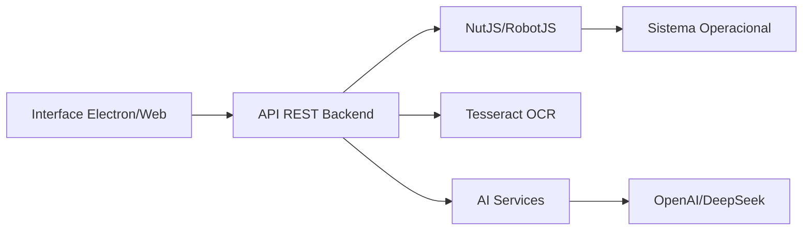

# HUU Desktop Automation Suite

<div align="center">
  
  
  <h3>🚀 Aplicação Desktop de Automação Profissional</h3>
  
  
  
  
  
  
  
  
  
  
  
  
  
  **Aplicação Desktop Electron + Backend API Independente + Interface React**
  
  [Download](#-download) • 
  [Instalação](#-instalação) • 
  [Arquitetura](#-arquitetura) • 
  [Backend Standalone](#-backend-standalone) • 
  [API Docs](#-api-endpoints) • 
  [Desenvolvimento](#-desenvolvimento)
</div>

---

## 📋 Índice

- [🎯 Visão Geral](#-visão-geral)
- [✨ Novidades (Branch Development)](#-novidades-branch-development)
- [🏗️ Arquitetura](#️-arquitetura)
- [💾 Download](#-download)
- [🚀 Instalação](#-instalação)
- [🎮 Modos de Execução](#-modos-de-execução)
- [🔌 Backend Standalone](#-backend-standalone)
- [⚡ Funcionalidades](#-funcionalidades)
- [📡 API Endpoints](#-api-endpoints)
- [🖥️ Interface Desktop](#️-interface-desktop)
- [🔧 Desenvolvimento](#-desenvolvimento)
- [🧪 Testes](#-testes)
- [⚙️ Configuração](#️-configuração)
- [🔒 Segurança](#-segurança)
- [📊 Status do Projeto](#-status-do-projeto)
- [🤝 Contribuindo](#-contribuindo)
- [📄 Licença](#-licença)

---

## 🎯 Visão Geral

O **HUU Desktop Automation Suite** evoluiu de uma aplicação web para uma **suite completa de automação desktop** com três modos de operação:

1. **🖥️ Aplicação Desktop Electron** - Interface gráfica completa com backend integrado
2. **🔌 Backend API Standalone** - API REST independente para integração com outros projetos
3. **🌐 Modo Web Development** - Frontend React + Backend separados para desenvolvimento

### Principais Evolução (main → development)

| Aspecto | Branch Main | Branch Development |
|---------|-------------|-------------------|
| **Tipo** | Web Application | Desktop Application (Electron) |
| **Arquitetura** | Frontend + Backend separados | Aplicação unificada ou modular |
| **Distribuição** | Manual (2 servidores) | Executável único (.app, .exe, .deb) |
| **Backend** | Acoplado ao projeto | Completamente separável |
| **Interface** | Web Browser | Desktop nativo + Web |
| **Instalação** | npm install + config | Download e executa |

---

## ✨ Novidades (Branch Development)

### 🖥️ **Aplicação Desktop com Electron**
- Aplicação desktop nativa para Windows, macOS e Linux
- Interface integrada sem necessidade de browser
- Auto-updater para atualizações automáticas
- System tray para execução em background
- Menus nativos e atalhos de teclado

### 🔌 **Backend Completamente Independente**
- Backend extraível como projeto separado
- Script de extração automática (`npm run extract:backend`)
- Package.json dedicado para backend standalone
- Documentação específica (BACKEND_README.md)
- 100% reutilizável em outros projetos

### 🎨 **Interface Renovada**
- Migração de react-beautiful-dnd para @hello-pangea/dnd
- AutomationPage como página principal
- HashRouter para compatibilidade com Electron
- Melhorias na UX de drag-and-drop
- Integração nativa com APIs do sistema

### 🛠️ **Novos Scripts e Comandos**
```bash
# Electron Desktop
npm start                  # Inicia aplicação Electron
npm run dist:mac          # Build para macOS
npm run dist:win          # Build para Windows  
npm run dist:linux        # Build para Linux

# Backend Standalone
npm run start:backend      # Backend sozinho (dev)
npm run start:backend:prod # Backend sozinho (prod)
npm run dev:backend       # Backend com hot reload
npm run extract:backend   # Extrai backend para outro projeto

# Desenvolvimento
npm run dev              # Electron em modo desenvolvimento
npm run build:all        # Compila tudo (web + backend)
```

---

## 🏗️ Arquitetura

### Estrutura Modular

```
huu-desktop-automation/
├── 📱 electron/              # Aplicação Electron
│   ├── main.js              # Processo principal
│   └── preload.js           # Bridge de segurança
│
├── 🔧 src/                  # Backend (API REST)
│   ├── application/         # Casos de uso
│   ├── domain/             # Entidades
│   ├── infrastructure/    # Adaptadores (NutJS)
│   ├── interface/          # Controllers/Routes
│   └── index.ts            # Entry point do backend
│
├── 🎨 web/                  # Frontend React
│   ├── src/
│   │   ├── components/     # Componentes React
│   │   ├── pages/         # Páginas
│   │   └── services/      # Serviços/API
│   └── dist/              # Build do frontend
│
├── 📦 dist/                 # Backend compilado
├── 🚀 release/             # Builds do Electron
│
├── 📋 Arquivos de Configuração
├── package.json            # Principal (Electron + tudo)
├── backend-package.json    # Backend standalone
├── electron-builder.yml    # Config de build Electron
└── tsconfig.json          # TypeScript config
```

### Fluxo de Dados



---

## 💾 Download

### Releases Prontas (Em breve)

| Sistema | Download | Requisitos |
|---------|----------|------------|
| 🍎 **macOS** | `HUU-Desktop-1.0.1.dmg` | macOS 10.14+ |
| 🪟 **Windows** | `HUU-Desktop-Setup-1.0.1.exe` | Windows 10+ |
| 🐧 **Linux** | `HUU-Desktop-1.0.1.AppImage` | Ubuntu 20.04+ |

### Build do Código Fonte

```bash
# Clone o repositório
git clone -b development https://github.com/frederico-kluser/huu-desktop-api-automation.git
cd huu-desktop-api-automation

# Instale dependências
npm install

# Build para sua plataforma
npm run dist:mac    # macOS
npm run dist:win    # Windows
npm run dist:linux  # Linux
```

---

## 🚀 Instalação

### Método 1: Aplicação Desktop (Recomendado)

```bash
# 1. Clone e instale
git clone -b development https://github.com/frederico-kluser/huu-desktop-api-automation.git
cd huu-desktop-api-automation
npm install

# 2. Configure (opcional)
cp .env.example .env
# Edite .env com suas API keys

# 3. Execute
npm start  # Abre aplicação Electron
```

### Método 2: Backend API Apenas

```bash
# Extraia o backend para um novo projeto
npm run extract:backend ../meu-backend-api

# Entre no diretório
cd ../meu-backend-api

# Instale e execute
npm install
npm run dev
```

### Método 3: Desenvolvimento Web

```bash
# Terminal 1 - Backend
npm run start:backend

# Terminal 2 - Frontend (nova aba)
npm run dev:web
```

---

## 🎮 Modos de Execução

### 1. Desktop Electron (Padrão)

```bash
npm start
```
- ✅ Interface gráfica nativa
- ✅ Backend integrado
- ✅ Atualizações automáticas
- ✅ System tray
- ✅ Menus e atalhos

### 2. Backend Standalone

```bash
npm run start:backend
```
- ✅ API REST pura
- ✅ Sem interface gráfica
- ✅ Integrável com qualquer frontend
- ✅ Docker ready
- ✅ Microserviço

### 3. Modo Desenvolvimento

```bash
npm run dev
```
- ✅ Hot reload
- ✅ DevTools aberto
- ✅ Logs detalhados
- ✅ Source maps

---

## 🔌 Backend Standalone

### Extração Rápida

```bash
# Extrair backend completo
npm run extract:backend ./backend-projeto

# Estrutura extraída:
backend-projeto/
├── src/           # Código fonte
├── tests/         # Testes
├── package.json   # Dependências
├── tsconfig.json  # TypeScript
├── start.sh       # Script início Linux/Mac
├── start.bat      # Script início Windows
└── README.md      # Documentação
```

### Uso em Outros Projetos

```javascript
// Exemplo Node.js
const axios = require('axios');

const api = axios.create({
  baseURL: 'http://localhost:3000/api/v1'
});

// Automação
await api.post('/automation/execute', {
  actions: [
    { type: 'mouse_move', x: 100, y: 200 },
    { type: 'mouse_click', button: 'left' },
    { type: 'keyboard_type', text: 'Hello World' }
  ]
});
```

```python
# Exemplo Python
import requests

# Capturar tela
response = requests.post('http://localhost:3000/api/v1/screen/capture')
screenshot_base64 = response.json()['data']['image']
```

---

## ⚡ Funcionalidades

### 🖱️ Automação de Mouse
- Movimento preciso para coordenadas
- Cliques (simples, duplo, direito)
- Drag and drop
- Scroll
- Tracking em tempo real

### ⌨️ Automação de Teclado
- Digitação de texto
- Atalhos e combinações
- Teclas especiais
- Velocidade ajustável
- Simulação humana

### 📸 Captura de Tela
- Screenshot fullscreen
- Captura de região
- Múltiplos monitores
- Formato base64/buffer
- OCR integrado

### 🔍 OCR (Reconhecimento de Texto)
- Extração de texto de imagens
- Múltiplos idiomas (por, eng, spa)
- Processamento em lote
- Worker pool paralelo
- Cache inteligente

### 🤖 Integração com IA
- **OpenAI**: GPT-4, GPT-3.5
- **DeepSeek**: Chat, Reasoner, Coder
- Análise de tela com IA
- Geração de scripts
- Automação inteligente

### 📊 Monitoramento
- Eventos de mouse/teclado em tempo real
- Server-Sent Events (SSE)
- Buffer circular de eventos
- Métricas de performance
- Health checks

---

## 📡 API Endpoints

### Core Endpoints

| Método | Endpoint | Descrição |
|--------|----------|-----------|
| GET | `/health` | Status do servidor |
| GET | `/api/v1/status` | Status detalhado da API |

### Automação

| Método | Endpoint | Descrição |
|--------|----------|-----------|
| POST | `/api/v1/automation/execute` | Executa sequência de ações |
| POST | `/api/v1/automation/record` | Inicia gravação de macro |
| POST | `/api/v1/automation/stop` | Para gravação |
| GET | `/api/v1/automation/replay/{id}` | Reproduz macro gravada |

### Mouse

| Método | Endpoint | Descrição |
|--------|----------|-----------|
| GET | `/api/v1/mouse/position` | Posição atual |
| POST | `/api/v1/mouse/move` | Move para coordenadas |
| POST | `/api/v1/mouse/click` | Clique |
| POST | `/api/v1/mouse/drag` | Drag and drop |
| POST | `/api/v1/mouse/scroll` | Scroll |

### Teclado

| Método | Endpoint | Descrição |
|--------|----------|-----------|
| POST | `/api/v1/keyboard/type` | Digita texto |
| POST | `/api/v1/keyboard/press` | Pressiona tecla |
| POST | `/api/v1/keyboard/shortcut` | Atalho |

### Tela

| Método | Endpoint | Descrição |
|--------|----------|-----------|
| POST | `/api/v1/screen/capture` | Screenshot |
| POST | `/api/v1/screen/region` | Captura região |
| GET | `/api/v1/screen/info` | Info monitores |

### OCR

| Método | Endpoint | Descrição |
|--------|----------|-----------|
| POST | `/api/v1/ocr/extract` | Extrai texto |
| POST | `/api/v1/ocr/batch` | Batch processing |

### IA

| Método | Endpoint | Descrição |
|--------|----------|-----------|
| POST | `/api/v1/llm/completion` | Completação de texto |
| POST | `/api/v1/llm/analyze-screen` | Analisa screenshot |

### Streaming

| Método | Endpoint | Descrição |
|--------|----------|-----------|
| GET | `/api/v1/events/mouse/stream` | Stream eventos mouse |
| GET | `/api/v1/events/keyboard/stream` | Stream eventos teclado |

---

## 🖥️ Interface Desktop

### Recursos da Interface

- **Visual Builder**: Construtor drag-and-drop de automações
- **Live Preview**: Visualização em tempo real das ações
- **Macro Recorder**: Gravador de macros integrado
- **Script Editor**: Editor com syntax highlighting
- **Test Runner**: Executor de testes de automação
- **Logs Viewer**: Visualizador de logs em tempo real

### Atalhos de Teclado

| Atalho | Ação |
|--------|------|
| `Ctrl/Cmd + N` | Nova automação |
| `Ctrl/Cmd + O` | Abrir automação |
| `Ctrl/Cmd + S` | Salvar automação |
| `F5` | Executar |
| `Shift + F5` | Parar execução |
| `Ctrl/Cmd + Shift + R` | Gravar macro |
| `F12` | DevTools |

---

## 🔧 Desenvolvimento

### Pré-requisitos

- Node.js 18+ (recomendado 20+)
- npm 8+ ou pnpm 8+
- Git
- Permissões de acessibilidade (macOS)
- Build tools do SO (Windows Build Tools, Xcode, gcc)

### Setup Desenvolvimento

```bash
# Clone com submodules
git clone --recursive -b development <repo-url>
cd huu-desktop-api-automation

# Instale dependências
npm install

# Configure ambiente
cp .env.example .env
# Edite .env com suas configurações

# Desenvolvimento com hot reload
npm run dev

# Testes
npm test
npm run test:coverage

# Linting e formatação
npm run lint
npm run format
```

### Estrutura de Branches

- `main` - Versão estável (web-only)
- `development` - Desenvolvimento ativo (Electron + features)
- `feature/*` - Novas funcionalidades
- `fix/*` - Correções
- `release/*` - Preparação de releases

### Build & Deploy

```bash
# Build completo
npm run build:all

# Build por plataforma
npm run dist:mac
npm run dist:win
npm run dist:linux

# Publicar (requer configuração)
npm run publish
```

---

## 🧪 Testes

### Executar Testes

```bash
# Todos os testes
npm test

# Testes unitários
npm run test:unit

# Testes de integração
npm run test:integration

# Coverage
npm run test:coverage

# Testes da API
npm run test:api
```

### Estrutura de Testes

```
tests/
├── unit/           # Testes unitários
├── integration/    # Testes de integração
├── e2e/           # Testes end-to-end
└── fixtures/      # Dados de teste
```

### Coverage Atual

- **Statements**: ~70%
- **Branches**: ~65%
- **Functions**: ~75%
- **Lines**: ~70%
- **Target**: 80%

---

## ⚙️ Configuração

### Variáveis de Ambiente (.env)

```bash
# Server
PORT=3000
HOST=0.0.0.0
NODE_ENV=development
LOG_LEVEL=info

# AI Services (opcional)
OPENAI_API_KEY=sk-...
DEEPSEEK_API_KEY=...
GOOGLE_GENERATIVE_AI_API_KEY=...

# OCR
OCR_LANG=por+eng
OCR_WORKERS=4

# Security (futuro)
JWT_SECRET=...
API_KEY=...
```

### Configuração Electron (electron-builder.yml)

```yaml
appId: com.huu.desktop.automation
productName: HUU Desktop Automation
directories:
  output: release
  
mac:
  category: public.app-category.productivity
  hardenedRuntime: true
  
win:
  requestedExecutionLevel: requireAdministrator
  
linux:
  category: Utility
```

### Permissões do Sistema

#### macOS
```bash
# Acessibilidade
Sistema > Privacidade > Acessibilidade > [Permitir HUU]

# Screen Recording
Sistema > Privacidade > Gravação de Tela > [Permitir HUU]
```

#### Windows
- Execute como Administrador na primeira vez
- Windows Defender pode solicitar permissão

#### Linux
```bash
# Adicione usuário ao grupo input
sudo usermod -a -G input $USER

# Reinicie a sessão
```

---

## 🔒 Segurança

### Status Atual

⚠️ **Desenvolvimento**: Segurança básica implementada

- [ ] Autenticação JWT (desabilitada)
- [ ] Rate limiting (planejado)
- [ ] API Keys (planejado)
- [x] Validação de entrada (Zod)
- [x] Sanitização de dados
- [x] CORS configurado
- [x] Context isolation (Electron)

### Recomendações

1. **Não exponha a API publicamente** sem autenticação
2. **Use HTTPS** em produção
3. **Configure firewall** para limitar acesso
4. **Rode com menor privilégio** possível
5. **Mantenha dependências atualizadas**

---

## 📊 Status do Projeto

### Implementado ✅

- [x] Core de automação (mouse, teclado, tela)
- [x] API REST completa
- [x] Interface web React
- [x] Aplicação Electron
- [x] OCR com Tesseract
- [x] Integração com IA
- [x] Sistema de eventos
- [x] Drag-and-drop builder
- [x] Backend standalone
- [x] Auto-updater
- [x] System tray

### Em Desenvolvimento 🚧

- [ ] Autenticação e autorização
- [ ] Cloud sync de automações
- [ ] Marketplace de scripts
- [ ] Mobile companion app
- [ ] Gravação de vídeo
- [ ] Webhooks
- [ ] Plugins system

### Roadmap 🗺️

**Q1 2025**
- Autenticação completa
- Dashboard analytics
- Cloud storage

**Q2 2025**
- Mobile app
- Marketplace
- Enterprise features

---

## 🤝 Contribuindo

Contribuições são bem-vindas! Veja nosso [CONTRIBUTING.md](CONTRIBUTING.md) para detalhes.

### Como Contribuir

1. Fork o projeto
2. Crie sua feature branch (`git checkout -b feature/AmazingFeature`)
3. Commit suas mudanças (`git commit -m 'Add: amazing feature'`)
4. Push para a branch (`git push origin feature/AmazingFeature`)
5. Abra um Pull Request

### Código de Conduta

Este projeto adere ao [Código de Conduta](CODE_OF_CONDUCT.md). Ao participar, você concorda em manter este código.

---

## 📄 Licença

Este projeto está licenciado sob a MIT License - veja o arquivo [LICENSE](LICENSE) para detalhes.

### Atribuições

- [NutJS](https://github.com/nut-tree/nut.js) - Core de automação
- [Electron](https://www.electronjs.org/) - Framework desktop
- [React](https://reactjs.org/) - Interface de usuário
- [Fastify](https://www.fastify.io/) - Framework web
- [Tesseract.js](https://tesseract.projectnaptha.com/) - OCR

---

## 📞 Suporte

- **Issues**: [GitHub Issues](https://github.com/frederico-kluser/huu-desktop-api-automation/issues)
- **Discussões**: [GitHub Discussions](https://github.com/frederico-kluser/huu-desktop-api-automation/discussions)
- **Email**: suporte@huu.dev (em breve)
- **Discord**: [HUU Community](https://discord.gg/huu) (em breve)

---

<div align="center">
  
  **Desenvolvido com ❤️ pela equipe HUU**
  
  [Website](https://huu.dev) • 
  [Blog](https://blog.huu.dev) • 
  [Twitter](https://twitter.com/huudev) • 
  [LinkedIn](https://linkedin.com/company/huudev)
  
  © 2024 HUU Desktop Automation - Todos os direitos reservados
  
</div>