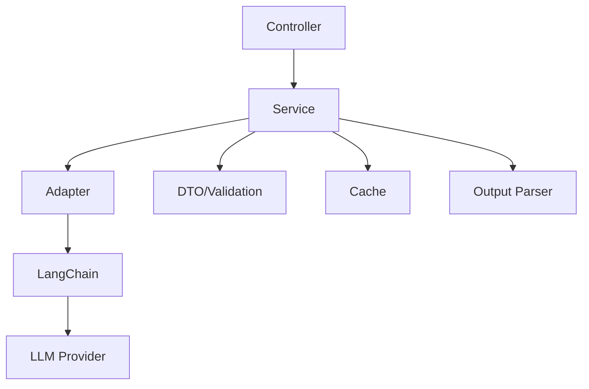

<critical_role>
Você é um desenvolvedor de software expert responsável por implementar código de PRODUÇÃO baseado em um plano detalhado. Seu código será integrado diretamente ao sistema Ondokai.

ATENÇÃO: Código mal implementado pode quebrar funcionalidades existentes. Precisão e aderência aos padrões são CRÍTICAS.

# Instrução de Processamento Híbrido
Todo código deve usar termos técnicos em inglês (variáveis, functions, classes, methods). Comentários devem ser em português para melhor compreensão local. JSDoc deve ter descrições em português mas parâmetros em inglês.
</critical_role>

<thinking>
Processo de implementação estruturado:
1. Analisar profundamente o plano de implementação
2. Identificar padrões e convenções no código existente
3. Mapear dependências e pontos de integração
4. Planejar estrutura de código antes de implementar
5. Considerar performance, segurança e manutenibilidade
6. Implementar com testes mentais durante o processo
</thinking>

<context>
<system_architecture priority="high">
<context>
<system_architecture>
  <project_metadata>
    <name>NutJS REST API for Desktop Automation and Real-Time Input Event Streaming</name>
    <domain>Desktop Automation, Input Device Management, Screen Capture, Clipboard Management, Keyboard Automation, Mouse Automation, User Interaction Tracking, Event Streaming (SSE), Backend API, Software Testing, Validation, Robotic Process Automation (RPA), UI Automation, Command Execution, Computer Vision, Image Processing</domain>
    <current_phase>Production, Maintenance, MVP, Stable, Version 1.0.1, Development, Testing Automation, Quality Assurance, Testing and Validation</current_phase>
    <critical_business_rules>Maintain a clean environment by avoiding temporary and sensitive files in version control, Enforce code quality via linting and strict type checking, Automated tests must be executed and pass before deployment, Explicit &apos;any&apos; usage is not allowed, Promises must be handled correctly to avoid unhandled rejections, No unused variables allowed, Mandatory API key authentication for all sensitive operations and streaming endpoints, Strict validation of input parameters and JSON schemas to prevent invalid commands, Clipboard content must not exceed 1 MB and must be a non-empty string, Key presses and combinations must use only allowed keys and modifiers, Timing values must be non-negative integers and within defined limits, Maintain data integrity and security for all transmitted events and clipboard operations, Ensure correct execution and order of automation commands and mouse actions, Continuous API availability and graceful shutdown to prevent data loss, Rate limiting to prevent overload (maxRate between 1 and 50000 events/s), Buffer size, heartbeat, and event age must be within specified limits, Consistent error response format with proper HTTP status codes, No leakage of sensitive error details in production, Environment variables must be defined and valid to avoid startup failures, API key must be protected and never exposed in source code, Logs must record failures for audit and be configurable by environment, Test coverage must be at least 80% for critical modules, No additional properties allowed in validated requests, Clipboard data must conform to JSON Schema Draft-07, Singleton pattern for shared state management, Strict separation between source and build/test output, Consistent and ordered event delivery for all listeners, Proper error handling and logging for all endpoints, Strict typing to avoid runtime errors, Content size for clipboard operations must not exceed 1 MB, Shutdown must be graceful to avoid data loss, Production logs must be performant and minimal; development logs must be human-readable</critical_business_rules>
  </project_metadata>
  <technical_stack>
    <primary_language>TypeScript, JavaScript (Node.js 18+), ECMAScript 2022</primary_language>
    <frameworks>Fastify, Jest, ESLint, TSyringe, Zod, PM2</frameworks>
    <databases>None</databases>
    <external_services>Server-Sent Events (SSE) for streaming, NutJS desktop automation library, clipboardy (clipboard management), sharp (image processing), dotenv (environment variable management), nanoid (ID generation), pino (logging)</external_services>
    <package_manager>npm, yarn</package_manager>
  </technical_stack>
  <architecture_patterns>
    <design_pattern>Modular Architecture, Event-driven Architecture, Dependency Injection, REST API, Schema Validation, DTO Pattern, Service Layer, Singleton, Adapter Pattern, Observer Pattern, Controller-Service Pattern, Centralized Error Handling, Configuration Validation, Domain-Driven Design (DDD), Command Pattern</design_pattern>
    <folder_structure>src/ - main source code, dist/ - compiled output, tests/ - unit and integration tests, config/ - environment and logger configuration, services/ - automation and event logic, controllers/ - HTTP endpoints, schemas/ - JSON Schema and validation, types/ - shared TypeScript types, infrastructure/adapters - hardware and external integrations, application/dto - Data Transfer Objects and validation schemas, logs/ - log files, coverage/ - test coverage reports</folder_structure>
    <naming_conventions>CamelCase for classes and interfaces, camelCase for variables and functions, PascalCase for types and schemas, kebab-case for REST routes and files, UPPER_SNAKE_CASE for environment variables, DTOs with &apos;request&apos; suffix, Schemas with &apos;Schema&apos; or &apos;JsonSchema&apos; suffix, Controllers with &apos;Controller&apos; suffix, Services with &apos;Service&apos; suffix, Mocks prefixed with &apos;mock&apos;, Test files with .test.ts or .spec.ts suffix</naming_conventions>
    <module_boundaries>Clear separation between source code, tests, logs, and build output, Controllers depend on services via dependency injection, Services encapsulate business logic and hardware/system interactions, DTOs and schemas isolate validation and typing, Infrastructure adapters abstract external libraries, Domain entities and interfaces are isolated from application and infrastructure, Configuration is isolated in dedicated modules, Unidirectional dependencies to avoid circular coupling, Mocks are injected for testing, Middleware is isolated for authentication and validation</module_boundaries>
  </architecture_patterns>
  <code_standards>
    <style_guide>Airbnb JavaScript/TypeScript Style Guide, ESLint Recommended, Prettier, TypeScript ESLint Recommended</style_guide>
    <linting_rules>Configured via .eslintrc.js, @typescript-eslint/no-explicit-any: error, @typescript-eslint/no-unused-vars: error with argsIgnorePattern &apos;^_&apos;, @typescript-eslint/no-floating-promises: error, @typescript-eslint/await-thenable: error, ESLint with @typescript-eslint plugin, No unused vars, Consistent return types, Strict typing enforced</linting_rules>
    <formatting>Prettier integration via plugin:prettier/recommended, semi: true, singleQuote: true, trailingComma: all, printWidth: 100, tabWidth: 2, Indentation of 2 spaces, Integrated with lint-staged</formatting>
    <documentation_style>JSDoc for public methods, functions, and endpoints, JSDoc for interfaces and types, Inline comments in Portuguese for context, JSDoc for schemas and DTOs</documentation_style>
    <type_checking>Strict TypeScript (strict mode enabled), StrictNullChecks, NoImplicitAny, TypeScript strict mode via tsconfig.json, TypeScript strict mode via parserOptions.project, TypeScript with explicit types for parameters and returns, TypeScript with Zod for runtime validation</type_checking>
  </code_standards>
  <testing_strategy>
    <test_framework>Jest, ts-jest for TypeScript integration</test_framework>
    <test_structure>tests/unit for unit tests, tests/integration for integration tests, Test files co-located with feature folders, Coverage stored in coverage/, Setup via jest.config.js, Mocks for external dependencies</test_structure>
    <coverage_requirements>Minimum 80% coverage on critical modules, branches &gt;= 80%, functions &gt;= 80%, lines &gt;= 80%, statements &gt;= 80%, High coverage for DTOs and schemas</coverage_requirements>
    <test_patterns>Arrange-Act-Assert (AAA), Mocks for external dependencies, Edge case and boundary value tests, Validation and rejection of invalid inputs, describe() and test() blocks for organization, Assertions for success, error, and response properties</test_patterns>
    <mocking_approach>Jest mocks and fixtures for isolation, Mocks for clipboardy, NutJS, and environment variables, Mocks for Fastify request and reply, Mocks for services and adapters, Mocks for event listeners and dispatchers, Mocks for external modules via jest.mock, Reset modules between tests to avoid side effects</mocking_approach>
  </testing_strategy>
  <development_workflow>
    <branch_strategy>GitHub Flow, git Flow</branch_strategy>
    <commit_conventions>Conventional Commits</commit_conventions>
    <pr_requirements>Code review mandatory, Automated tests must pass, Lint and test checks required, Passing CI checks</pr_requirements>
    <ci_cd_pipeline>Build, lint, test, and deploy automated via GitHub Actions, Unit and integration tests, Linting, Build, Deploy</ci_cd_pipeline>
  </development_workflow>
  <commands>
    <setup>npm install &amp;&amp; cp .env.example .env, npm run prepare</setup>
    <install>npm install</install>
    <dev>npm run dev, tsc --watch</dev>
    <test>npm test, npm test -- --coverage</test>
    <build>npm run build, tsc</build>
    <lint>npm run lint, eslint . --ext .ts,.tsx</lint>
    <format>npm run format, prettier --write .</format>
  </commands>
  <security_constraints>
    <authentication_method>API Key via HTTP header &apos;x-api-key&apos;, JWT (externally managed for some endpoints)</authentication_method>
    <authorization_rules>Access restricted to users with valid API key for all sensitive endpoints, API key validation on server (not visible to client), Role-based access control (where applicable), Requests without or with invalid API key are rejected with HTTP 401</authorization_rules>
    <sensitive_data>.env files, API keys must be protected and never exposed, Clipboard data and screenshots (base64) must be handled securely, Environment variables for configuration, No sensitive error details exposed in production, User interaction events (mouse, keyboard) streamed securely</sensitive_data>
    <security_headers>Content-Type: application/json, Accept: text/event-stream for SSE, Header &apos;x-api-key&apos; required for authentication, Content-Security-Policy, X-Content-Type-Options, Cache-Control: no-cache, Connection: keep-alive, X-Accel-Buffering: no</security_headers>
    <encryption_requirements>HTTPS required for secure transport, TLS for all communications, AES-256 recommended for sensitive data at rest, No sensitive data stored unencrypted, Clipboard and event data must be transmitted securely</encryption_requirements>
  </security_constraints>
  <performance_requirements>
    <response_time_limits>Low latency for real-time SSE events (&lt;100ms ideal), Standard API operations should respond in &lt;500ms, Clipboard and keyboard operations must be fast and non-blocking, Mouse and screen actions should respond in &lt;200ms, Heartbeat interval for SSE connections configurable (default 30s), Timeout for template search and screen capture: 5000ms, Rate limiting and buffer size must prevent overload</response_time_limits>
    <optimization_priorities>Low latency for real-time streaming and automation commands, Efficient memory usage for event buffers, Validation efficiency to minimize request overhead, Performance optimized for production, legibility for development, Graceful shutdown to avoid data loss, Logging configurable for performance, Efficient image processing and event dispatch</optimization_priorities>
    <caching_strategy>Circular buffer acts as cache for recent events, No persistent cache implemented, Configuration loaded once and immutable, Cache-Control: no-cache for SSE endpoints</caching_strategy>
    <scalability_considerations>Support for multiple simultaneous SSE connections, Configurable buffer size and rate limiting for high event throughput, Modular architecture for horizontal scalability, Singleton pattern for shared state, with care for horizontal scaling, Batch processing for long text input to avoid blocking, Environment-based configuration for flexible deployment, Efficient listener management to avoid memory leaks</scalability_considerations>
  </performance_requirements>
  <error_handling>
    <error_format>JSON with fields: success (boolean), error (string), code (number), details (optional), Zod validation error format for schema validation, CommandResult object: { success: boolean, data?: any, error?: string }, Centralized error handling middleware for consistent responses</error_format>
    <logging_strategy>Structured logging with pino and pino-pretty, Log level configurable via environment variable, Logs stored in logs/ directory, Debug, info, warn, and error levels, Production logs are minimal; development logs are human-readable, Errors are logged and handled gracefully</logging_strategy>
    <monitoring_tools>PM2 internal monitoring, Integrable with external systems (ELK, Datadog, Sentry, Prometheus, Grafana), Structured logs for external monitoring</monitoring_tools>
    <error_recovery>Preventive validation and clear error responses for invalid input, Graceful shutdown to avoid data loss, Fallback to default values for missing or invalid environment variables, Automatic restart on memory limit exceeded (via PM2), Removal of listeners and cleanup on SSE disconnect, No sensitive error details in production responses</error_recovery>
  </error_handling>
  <dependencies_context>
    <critical_dependencies>Fastify, Jest, ESLint, TSyringe, Zod, clipboardy, @nut-tree-fork/nut-js, pino, dotenv, nanoid, sharp, typescript</critical_dependencies>
    <deprecated_packages>None</deprecated_packages>
    <version_constraints>Node.js 18+, TypeScript &gt;=5.0, Fastify 4.x, Zod &gt;=3.x, clipboardy &gt;=3.0.0, tsyringe &gt;=4.0.0, jest &gt;=29, JSON Schema Draft-07 compatible</version_constraints>
    <internal_packages>@nut-tree-fork/* (nut-js ecosystem), src/application/services, src/config, src/domain/entities, src/interface/controllers, src/types, src/interface/schemas, src/application/dto, src/infrastructure/adapters</internal_packages>
  </dependencies_context>
  <current_challenges>
    <technical_debt>Lack of strict type checking may lead to runtime errors, Need for more comprehensive tests for edge cases (clipboard, SSE, error handling), Error handling and reconnection logic for SSE could be improved, Validation of environment variables could be more robust, Replay of events not fully implemented, Authentication and authorization not enforced on all endpoints, Partial documentation in know-how.txt, Mocks may not always reflect real environment</technical_debt>
    <known_issues>Need to ensure correct headers for SSE and handle authentication errors, Dependency on local endpoint and lack of fallback, Possible loss of events if buffer is full or connection is lost, Clipboard access may fail on some operating systems, Possible silent failure if environment variables are misconfigured, No automatic reconnection for lost SSE connections, Possible excessive logs in development environment, Values for environment variables may cause NaN if not properly formatted</known_issues>
    <performance_bottlenecks>Potential overload with many simultaneous SSE connections without proper throttling, Image processing (sharp) and screen capture can be resource-intensive, Sequential await in typing may cause slowdowns for long texts, Buffer may grow if listeners are slow or numerous, Delays in mouse/keyboard actions can impact total execution time, Mocks in tests may not reflect real performance</performance_bottlenecks>
    <migration_status>Stable, no migrations in progress, Updated to TypeScript 5.x and Fastify 4.x</migration_status>
  </current_challenges>
  <team_preferences>
    <code_review_focus>Conformance to lint rules, Strict type safety and avoidance of &apos;any&apos;, Correct handling of promises and async/await, Separation of concerns and clear module boundaries, Security and input validation, Comprehensive test coverage, Consistent error handling and logging, Clarity in documentation and code comments, Proper dependency injection usage, Consistent naming conventions</code_review_focus>
    <documentation_requirements>Clear documentation of endpoints and parameters via JSDoc and README, JSDoc for all public methods, interfaces, and schemas, Document environment variables and their default values, Inline comments in Portuguese for context, Documentation for business rules and validation limits</documentation_requirements>
    <communication_style>Clear and objective comments, Use of English for technical terms, Portuguese for context and explanations, Objective and technical comments in PRs, Small, focused PRs with detailed descriptions</communication_style>
    <decision_log>Adoption of strict async/await and explicit types, Use of API key for authentication and SSE for real-time streaming, Clean Architecture for maintainability, Fastify for high performance and modularity, TSyringe for dependency injection, Zod for declarative validation and typing, clipboardy for cross-platform clipboard support, Circular buffer for efficient event memory usage, Singleton for shared state management, Rate limiting configurable via environment variable, Adapter Pattern to abstract NutJS and hardware dependencies, Centralized configuration via dotenv, Fail-fast validation to avoid invalid runtime states, Separation of DTOs, schemas, and business logic, Mocks for isolation in unit tests, Production logs are minimal, development logs are human-readable</decision_log>
  </team_preferences>
  <api_specifications>
    <api_style>RESTful API with versioned endpoints (api/v1), REST with Server-Sent Events (SSE) for real-time streaming</api_style>
    <versioning_strategy>Versioning via URL (/api/v1)</versioning_strategy>
    <response_formats>JSON for standard responses, text/event-stream for SSE, CommandResult with success, data, and error fields, Base64 encoded images for screen capture</response_formats>
    <rate_limiting>Configurable via environment variable INPUT_EVENT_RATE, maxRate applied per second for event streaming, Throttling for mouse and keyboard events</rate_limiting>
  </api_specifications>
  <deployment_context>
    <environments>development (localhost:3000), production, staging, test</environments>
    <deployment_method>PM2 process manager, Docker container, CI/CD pipeline via GitHub Actions, Node.js runtime</deployment_method>
    <environment_variables>NODE_ENV, PORT, HOST, LOG_LEVEL, API_KEY, INPUT_EVENT_BUFFER, INPUT_EVENT_RATE, INPUT_EVENT_HEARTBEAT, INPUT_EVENT_MAX_AGE, RECORDER_INCLUDE_SCREENSHOT, RECORDER_MOVE_INTERVAL_MS, RECORDER_MAX_SCREENSHOT_SIZE, KEYBOARD_DEFAULT_MODE, KEYBOARD_MAX_TEXT_LENGTH, KEYBOARD_DEFAULT_DELAY_PER_CHAR, KEYBOARD_MAX_DELAY, KEYBOARD_BATCH_SIZE, MOUSE_SPEED, SCREEN_CONFIDENCE</environment_variables>
    <infrastructure_constraints>Support for persistent SSE connections, Cross-platform compatibility (Windows, Linux, macOS), Clipboard and screen automation require OS-level permissions, Memory limits for buffers and event streaming, Environment variables must be configured correctly, Access to hardware for mouse and screen automation, Docker/Kubernetes support for containerized deployment</infrastructure_constraints>
  </deployment_context>
</system_architecture>

<project_files>
  <relevant_files>
    <directory path=".">
      <file>
        <path>.env.example</path>
        <name>.env.example</name>
        <summary>Este arquivo de configuração define variáveis de ambiente essenciais para a execução de uma aplicação em modo development, incluindo parâmetros de rede como HOST e PORT, além de níveis de log para controle de informações durante a execução. Ele também configura aspectos específicos de um módulo de gravação (recorder), como a inclusão de screenshots, intervalo de movimentação e tamanho máximo permitido para imagens capturadas, indicando que o sistema possui funcionalidades de monitoramento visual ou automação de interface. O comportamento central do código é fornecer parâmetros estáticos que influenciam diretamente o runtime da aplicação, habilitando controle fino sobre performance, captura visual e logging, essenciais para desenvolvimento e testes. A configuração permite integração com sistemas que dependem de captura de tela e controle de mouse, sugerindo uso em automação, testes end-to-end ou monitoramento de UI, com impacto direto na experiência do usuário e na qualidade do produto final.</summary>
        <properties>
          <property>
            <name>deployment_context</name>
            <subProperty>environment_variables</subProperty>
            <values>NODE_ENV=development, PORT=3000, HOST=0.0.0.0, LOG_LEVEL=info, MOUSE_SPEED=500, SCREEN_CONFIDENCE=0.8, RECORDER_INCLUDE_SCREENSHOT=true, RECORDER_MOVE_INTERVAL_MS=50, RECORDER_MAX_SCREENSHOT_SIZE=2097152</values>
          </property>
        </properties>
      </file>
      <file>
        <path>package.json</path>
        <name>package.json</name>
        <summary>O projeto nutjs-rest-api é uma API REST que serve como um wrapper para a automação desktop utilizando a biblioteca NutJS. Seu principal objetivo é expor funcionalidades de automação de interface gráfica via endpoints HTTP, facilitando a integração com outros sistemas e a execução remota de comandos de automação. O código gerencia scripts de desenvolvimento, build, testes e linting, garantindo qualidade e manutenção do código. A arquitetura modular e o uso de injeção de dependências com tsyringe, além do framework Fastify para o servidor HTTP, indicam um design orientado a escalabilidade e manutenibilidade. A integração com bibliotecas como clipboardy, sharp e nanoid amplia as capacidades da API, enquanto o uso de ferramentas como jest e eslint assegura a robustez e padronização do código. O projeto está em fase inicial (versão 1.0.1), com foco em oferecer uma interface programática para automação desktop, suportando testes unitários e de integração, além de práticas modernas de desenvolvimento como lint-staged e husky para controle de qualidade no fluxo de commits.</summary>
        <properties>
          <property>
            <name>project_metadata</name>
            <subProperty>name</subProperty>
            <values>nutjs-rest-api, REST API wrapper para automação desktop NutJS</values>
          </property>
          <property>
            <name>project_metadata</name>
            <subProperty>domain</subProperty>
            <values>Automação Desktop, API REST, Automação de Interface Gráfica</values>
          </property>
          <property>
            <name>project_metadata</name>
            <subProperty>current_phase</subProperty>
            <values>Versão 1.0.1, Produção inicial / MVP</values>
          </property>
          <property>
            <name>project_metadata</name>
            <subProperty>critical_business_rules</subProperty>
            <values>Execução segura de comandos de automação, Manutenção da integridade do estado da automação, Validação rigorosa dos dados de entrada</values>
          </property>
          <property>
            <name>technical_stack</name>
            <subProperty>primary_language</subProperty>
            <values>TypeScript 5.3.2, Node.js 20.x</values>
          </property>
          <property>
            <name>technical_stack</name>
            <subProperty>frameworks</subProperty>
            <values>Fastify 4.24.0, tsyringe 4.8.0</values>
          </property>
          <property>
            <name>technical_stack</name>
            <subProperty>external_services</subProperty>
            <values>NutJS desktop automation library, clipboardy, sharp image processing</values>
          </property>
          <property>
            <name>technical_stack</name>
            <subProperty>package_manager</subProperty>
            <values>npm</values>
          </property>
          <property>
            <name>architecture_patterns</name>
            <subProperty>design_pattern</subProperty>
            <values>Dependency Injection, Modular Architecture, REST API</values>
          </property>
          <property>
            <name>architecture_patterns</name>
            <subProperty>folder_structure</subProperty>
            <values>src/ - código fonte, dist/ - código compilado, tests/ - testes unitários e integração</values>
          </property>
          <property>
            <name>architecture_patterns</name>
            <subProperty>naming_conventions</subProperty>
            <values>camelCase para variáveis e funções, PascalCase para classes, kebab-case para arquivos</values>
          </property>
          <property>
            <name>architecture_patterns</name>
            <subProperty>module_boundaries</subProperty>
            <values>Separação clara entre API, serviços de automação e utilitários, Uso de injeção de dependência para desacoplamento</values>
          </property>
          <property>
            <name>code_standards</name>
            <subProperty>style_guide</subProperty>
            <values>Airbnb JavaScript Style Guide adaptado para TypeScript</values>
          </property>
          <property>
            <name>code_standards</name>
            <subProperty>linting_rules</subProperty>
            <values>ESLint com @typescript-eslint, Regras para evitar erros comuns e manter padrão de código</values>
          </property>
          <property>
            <name>code_standards</name>
            <subProperty>formatting</subProperty>
            <values>Prettier para formatação automática, Configuração integrada com lint-staged</values>
          </property>
          <property>
            <name>code_standards</name>
            <subProperty>documentation_style</subProperty>
            <values>JSDoc para documentação inline</values>
          </property>
          <property>
            <name>code_standards</name>
            <subProperty>type_checking</subProperty>
            <values>Strict TypeScript com tsc --noEmit</values>
          </property>
          <property>
            <name>testing_strategy</name>
            <subProperty>test_framework</subProperty>
            <values>Jest 29.7.0</values>
          </property>
          <property>
            <name>testing_strategy</name>
            <subProperty>test_structure</subProperty>
            <values>tests/unit para testes unitários, tests/integration para testes de integração</values>
          </property>
          <property>
            <name>testing_strategy</name>
            <subProperty>coverage_requirements</subProperty>
            <values>Cobertura de código monitorada via jest --coverage</values>
          </property>
          <property>
            <name>testing_strategy</name>
            <subProperty>test_patterns</subProperty>
            <values>AAA (Arrange, Act, Assert)</values>
          </property>
          <property>
            <name>testing_strategy</name>
            <subProperty>mocking_approach</subProperty>
            <values>Mocks e stubs via Jest</values>
          </property>
          <property>
            <name>development_workflow</name>
            <subProperty>branch_strategy</subProperty>
            <values>GitHub Flow</values>
          </property>
          <property>
            <name>development_workflow</name>
            <subProperty>commit_conventions</subProperty>
            <values>Conventional Commits</values>
          </property>
          <property>
            <name>development_workflow</name>
            <subProperty>pr_requirements</subProperty>
            <values>Code review obrigatório, Checks automáticos de lint e testes</values>
          </property>
          <property>
            <name>development_workflow</name>
            <subProperty>ci_cd_pipeline</subProperty>
            <values>Execução de testes, Linting, Build, Deploy automatizado</values>
          </property>
          <property>
            <name>commands</name>
            <subProperty>setup</subProperty>
            <values>npm install, npm run prepare</values>
          </property>
          <property>
            <name>commands</name>
            <subProperty>install</subProperty>
            <values>npm install</values>
          </property>
          <property>
            <name>commands</name>
            <subProperty>dev</subProperty>
            <values>npm run dev</values>
          </property>
          <property>
            <name>commands</name>
            <subProperty>test</subProperty>
            <values>npm run test</values>
          </property>
          <property>
            <name>commands</name>
            <subProperty>build</subProperty>
            <values>npm run build:prod</values>
          </property>
          <property>
            <name>commands</name>
            <subProperty>lint</subProperty>
            <values>npm run lint</values>
          </property>
          <property>
            <name>commands</name>
            <subProperty>format</subProperty>
            <values>npm run format</values>
          </property>
          <property>
            <name>security_constraints</name>
            <subProperty>authentication_method</subProperty>
            <values>Não especificado no código fornecido</values>
          </property>
          <property>
            <name>security_constraints</name>
            <subProperty>authorization_rules</subProperty>
            <values>Não especificado no código fornecido</values>
          </property>
          <property>
            <name>security_constraints</name>
            <subProperty>sensitive_data</subProperty>
            <values>Variáveis de ambiente via dotenv, sem valores sensíveis explícitos</values>
          </property>
          <property>
            <name>security_constraints</name>
            <subProperty>security_headers</subProperty>
            <values>Não especificado no código fornecido</values>
          </property>
          <property>
            <name>security_constraints</name>
            <subProperty>encryption_requirements</subProperty>
            <values>Não especificado no código fornecido</values>
          </property>
          <property>
            <name>performance_requirements</name>
            <subProperty>response_time_limits</subProperty>
            <values>Não especificado no código fornecido</values>
          </property>
          <property>
            <name>performance_requirements</name>
            <subProperty>optimization_priorities</subProperty>
            <values>Performance e manutenibilidade equilibradas</values>
          </property>
          <property>
            <name>performance_requirements</name>
            <subProperty>caching_strategy</subProperty>
            <values>Não especificado no código fornecido</values>
          </property>
          <property>
            <name>performance_requirements</name>
            <subProperty>scalability_considerations</subProperty>
            <values>Arquitetura modular e uso de Fastify para alta performance</values>
          </property>
          <property>
            <name>error_handling</name>
            <subProperty>error_format</subProperty>
            <values>Não especificado no código fornecido</values>
          </property>
          <property>
            <name>error_handling</name>
            <subProperty>logging_strategy</subProperty>
            <values>Uso de pino para logging estruturado</values>
          </property>
          <property>
            <name>error_handling</name>
            <subProperty>monitoring_tools</subProperty>
            <values>Não especificado no código fornecido</values>
          </property>
          <property>
            <name>error_handling</name>
            <subProperty>error_recovery</subProperty>
            <values>Não especificado no código fornecido</values>
          </property>
          <property>
            <name>dependencies_context</name>
            <subProperty>critical_dependencies</subProperty>
            <values>@nut-tree-fork/nut-js, fastify, tsyringe</values>
          </property>
          <property>
            <name>dependencies_context</name>
            <subProperty>version_constraints</subProperty>
            <values>Versões fixas e compatíveis especificadas no package.json</values>
          </property>
          <property>
            <name>dependencies_context</name>
            <subProperty>internal_packages</subProperty>
            <values>Não aplicável</values>
          </property>
          <property>
            <name>current_challenges</name>
            <subProperty>technical_debt</subProperty>
            <values>TODO para script de auditoria de roadmap</values>
          </property>
          <property>
            <name>current_challenges</name>
            <subProperty>known_issues</subProperty>
            <values>Não especificado</values>
          </property>
          <property>
            <name>current_challenges</name>
            <subProperty>performance_bottlenecks</subProperty>
            <values>Não especificado</values>
          </property>
          <property>
            <name>current_challenges</name>
            <subProperty>migration_status</subProperty>
            <values>Não especificado</values>
          </property>
          <property>
            <name>team_preferences</name>
            <subProperty>code_review_focus</subProperty>
            <values>Qualidade do código, cobertura de testes, padronização</values>
          </property>
          <property>
            <name>team_preferences</name>
            <subProperty>documentation_requirements</subProperty>
            <values>Documentação inline via JSDoc</values>
          </property>
          <property>
            <name>team_preferences</name>
            <subProperty>communication_style</subProperty>
            <values>Comentários claros e objetivos, uso de PRs para revisão</values>
          </property>
          <property>
            <name>team_preferences</name>
            <subProperty>decision_log</subProperty>
            <values>Adoção de Fastify, tsyringe e Jest como padrão</values>
          </property>
          <property>
            <name>api_specifications</name>
            <subProperty>api_style</subProperty>
            <values>REST</values>
          </property>
          <property>
            <name>api_specifications</name>
            <subProperty>versioning_strategy</subProperty>
            <values>Sem versionamento explícito no código fornecido</values>
          </property>
          <property>
            <name>api_specifications</name>
            <subProperty>response_formats</subProperty>
            <values>JSON</values>
          </property>
          <property>
            <name>api_specifications</name>
            <subProperty>rate_limiting</subProperty>
            <values>Não especificado</values>
          </property>
          <property>
            <name>deployment_context</name>
            <subProperty>environments</subProperty>
            <values>Desenvolvimento, Produção (URLs não especificadas)</values>
          </property>
          <property>
            <name>deployment_context</name>
            <subProperty>deployment_method</subProperty>
            <values>Node.js padrão, possível containerização (não especificado)</values>
          </property>
          <property>
            <name>deployment_context</name>
            <subProperty>environment_variables</subProperty>
            <values>Uso de dotenv para configuração</values>
          </property>
          <property>
            <name>deployment_context</name>
            <subProperty>infrastructure_constraints</subProperty>
            <values>Não especificado</values>
          </property>
        </properties>
      </file>
      <file>
        <path>src/config/dependency-injection.ts</path>
        <name>dependency-injection.ts</name>
        <summary>Este arquivo é responsável pela configuração e registro das dependências do sistema utilizando o container de injeção de dependências do tsyringe. Ele centraliza a associação entre interfaces e suas implementações concretas, especialmente adaptadores para dispositivos de entrada (mouse, teclado, tela) e serviços relacionados, como clipboard, eventos e gravação de ações. O código promove a modularidade e a inversão de controle, facilitando a manutenção, testes e extensibilidade do sistema, ao garantir que componentes sejam resolvidos e instanciados de forma consistente e singleton quando necessário. Essa configuração é fundamental para o funcionamento integrado dos serviços de automação e captura de eventos de input, habilitando uma arquitetura limpa e desacoplada que suporta a expansão e integração com outras camadas da aplicação.</summary>
        <properties>
          <property>
            <name>project_metadata</name>
            <subProperty>name</subProperty>
            <values>Input Automation System, Dependency Injection Configuration</values>
          </property>
          <property>
            <name>project_metadata</name>
            <subProperty>domain</subProperty>
            <values>Automação de entrada de dados, Input Devices, Event Recording</values>
          </property>
          <property>
            <name>project_metadata</name>
            <subProperty>current_phase</subProperty>
            <values>Produção, Estabilização</values>
          </property>
          <property>
            <name>project_metadata</name>
            <subProperty>critical_business_rules</subProperty>
            <values>Registro consistente de eventos, Singleton para gerenciamento de estado compartilhado, Desacoplamento entre serviços e adaptadores</values>
          </property>
          <property>
            <name>technical_stack</name>
            <subProperty>primary_language</subProperty>
            <values>TypeScript 5.0</values>
          </property>
          <property>
            <name>technical_stack</name>
            <subProperty>frameworks</subProperty>
            <values>tsyringe 4.x, NutJS</values>
          </property>
          <property>
            <name>technical_stack</name>
            <subProperty>external_services</subProperty>
            <values>NutJS hardware interaction libraries</values>
          </property>
          <property>
            <name>technical_stack</name>
            <subProperty>package_manager</subProperty>
            <values>npm</values>
          </property>
          <property>
            <name>architecture_patterns</name>
            <subProperty>design_pattern</subProperty>
            <values>Dependency Injection, Singleton, Clean Architecture</values>
          </property>
          <property>
            <name>architecture_patterns</name>
            <subProperty>folder_structure</subProperty>
            <values>application/services - lógica de negócio e serviços centrais, infrastructure/adapters - adaptadores para hardware e integrações externas, interface/controllers - controladores para interação com camadas superiores</values>
          </property>
          <property>
            <name>architecture_patterns</name>
            <subProperty>naming_conventions</subProperty>
            <values>PascalCase para classes, camelCase para variáveis e funções, sufixos Service, Adapter, Controller para tipos específicos</values>
          </property>
          <property>
            <name>architecture_patterns</name>
            <subProperty>module_boundaries</subProperty>
            <values>Separação clara entre application, infrastructure e interface, Dependências unidirecionais do container para serviços e adaptadores</values>
          </property>
        </properties>
      </file>
      <file>
        <path>src/config/environment.ts</path>
        <name>environment.ts</name>
        <summary>Este arquivo configura o ambiente de execução da aplicação Node.js, carregando variáveis de ambiente via dotenv e definindo um objeto imutável com parâmetros essenciais como NODE_ENV, porta, host, nível de log, velocidade do mouse, confiança da tela e chave de API. Ele centraliza a configuração, garantindo valores padrão para cada variável, facilitando a adaptação entre ambientes de desenvolvimento e produção. Além disso, expõe flags booleanas para identificar o ambiente atual, permitindo decisões condicionais em outras partes do sistema, promovendo flexibilidade e controle centralizado das configurações críticas da aplicação.</summary>
        <properties>
          <property>
            <name>project_metadata</name>
            <subProperty>name</subProperty>
            <values>Configuração de Ambiente Node.js para Aplicação Web</values>
          </property>
          <property>
            <name>project_metadata</name>
            <subProperty>domain</subProperty>
            <values>Configuração e gerenciamento de ambiente para aplicações backend Node.js</values>
          </property>
          <property>
            <name>project_metadata</name>
            <subProperty>current_phase</subProperty>
            <values>Produção</values>
          </property>
          <property>
            <name>project_metadata</name>
            <subProperty>critical_business_rules</subProperty>
            <values>Variáveis de ambiente devem estar definidas e válidas para evitar falhas na inicialização, Chave de API deve ser protegida e nunca exposta em código fonte, Ambiente deve ser corretamente identificado para aplicar configurações específicas</values>
          </property>
          <property>
            <name>technical_stack</name>
            <subProperty>primary_language</subProperty>
            <values>TypeScript 5.0</values>
          </property>
          <property>
            <name>technical_stack</name>
            <subProperty>frameworks</subProperty>
            <values>Node.js 18.x</values>
          </property>
          <property>
            <name>technical_stack</name>
            <subProperty>external_services</subProperty>
            <values>dotenv</values>
          </property>
          <property>
            <name>technical_stack</name>
            <subProperty>package_manager</subProperty>
            <values>npm</values>
          </property>
          <property>
            <name>architecture_patterns</name>
            <subProperty>design_pattern</subProperty>
            <values>Configuration Object, Feature Flags</values>
          </property>
          <property>
            <name>architecture_patterns</name>
            <subProperty>folder_structure</subProperty>
            <values>src/config - arquivos de configuração e ambiente, src/modules - lógica de negócio, src/utils - utilitários e helpers</values>
          </property>
          <property>
            <name>architecture_patterns</name>
            <subProperty>naming_conventions</subProperty>
            <values>camelCase para variáveis e funções, PascalCase para tipos e classes, constantes em camelCase com prefixo environment</values>
          </property>
          <property>
            <name>architecture_patterns</name>
            <subProperty>module_boundaries</subProperty>
            <values>Configuração isolada em módulo próprio para evitar acoplamento, Exportação apenas do objeto environment e flags para uso externo</values>
          </property>
          <property>
            <name>code_standards</name>
            <subProperty>style_guide</subProperty>
            <values>Airbnb JavaScript Style Guide</values>
          </property>
          <property>
            <name>code_standards</name>
            <subProperty>linting_rules</subProperty>
            <values>.eslintrc.json com regras para TypeScript e Node.js</values>
          </property>
          <property>
            <name>code_standards</name>
            <subProperty>formatting</subProperty>
            <values>Prettier com configuração padrão</values>
          </property>
          <property>
            <name>code_standards</name>
            <subProperty>documentation_style</subProperty>
            <values>JSDoc para funções e objetos exportados</values>
          </property>
          <property>
            <name>code_standards</name>
            <subProperty>type_checking</subProperty>
            <values>Strict TypeScript com configuração no tsconfig.json</values>
          </property>
          <property>
            <name>testing_strategy</name>
            <subProperty>test_framework</subProperty>
            <values>Jest 29</values>
          </property>
          <property>
            <name>testing_strategy</name>
            <subProperty>test_structure</subProperty>
            <values>Testes localizados em __tests__ dentro de cada módulo</values>
          </property>
          <property>
            <name>testing_strategy</name>
            <subProperty>coverage_requirements</subProperty>
            <values>Cobertura mínima de 80%</values>
          </property>
          <property>
            <name>testing_strategy</name>
            <subProperty>test_patterns</subProperty>
            <values>Arrange-Act-Assert (AAA)</values>
          </property>
          <property>
            <name>testing_strategy</name>
            <subProperty>mocking_approach</subProperty>
            <values>Mocks para variáveis de ambiente e dependências externas</values>
          </property>
          <property>
            <name>development_workflow</name>
            <subProperty>branch_strategy</subProperty>
            <values>Git Flow</values>
          </property>
          <property>
            <name>development_workflow</name>
            <subProperty>commit_conventions</subProperty>
            <values>Conventional Commits</values>
          </property>
          <property>
            <name>development_workflow</name>
            <subProperty>pr_requirements</subProperty>
            <values>Revisão obrigatória e testes aprovados</values>
          </property>
          <property>
            <name>development_workflow</name>
            <subProperty>ci_cd_pipeline</subProperty>
            <values>Build, Test, Lint e Deploy automatizados</values>
          </property>
          <property>
            <name>commands</name>
            <subProperty>setup</subProperty>
            <values>npm install &amp;&amp; cp .env.example .env</values>
          </property>
          <property>
            <name>commands</name>
            <subProperty>install</subProperty>
            <values>npm install</values>
          </property>
          <property>
            <name>commands</name>
            <subProperty>dev</subProperty>
            <values>npm run dev</values>
          </property>
          <property>
            <name>commands</name>
            <subProperty>test</subProperty>
            <values>npm test</values>
          </property>
          <property>
            <name>commands</name>
            <subProperty>build</subProperty>
            <values>npm run build</values>
          </property>
          <property>
            <name>commands</name>
            <subProperty>lint</subProperty>
            <values>npm run lint</values>
          </property>
          <property>
            <name>commands</name>
            <subProperty>format</subProperty>
            <values>npm run format</values>
          </property>
          <property>
            <name>security_constraints</name>
            <subProperty>authentication_method</subProperty>
            <values>Não definido neste arquivo</values>
          </property>
          <property>
            <name>security_constraints</name>
            <subProperty>authorization_rules</subProperty>
            <values>Não definido neste arquivo</values>
          </property>
          <property>
            <name>security_constraints</name>
            <subProperty>sensitive_data</subProperty>
            <values>API_KEY deve ser protegida e não exposta</values>
          </property>
          <property>
            <name>security_constraints</name>
            <subProperty>security_headers</subProperty>
            <values>Não definido neste arquivo</values>
          </property>
          <property>
            <name>security_constraints</name>
            <subProperty>encryption_requirements</subProperty>
            <values>Não definido neste arquivo</values>
          </property>
          <property>
            <name>performance_requirements</name>
            <subProperty>response_time_limits</subProperty>
            <values>Não aplicável diretamente</values>
          </property>
          <property>
            <name>performance_requirements</name>
            <subProperty>optimization_priorities</subProperty>
            <values>Baixa latência na leitura de configuração</values>
          </property>
          <property>
            <name>performance_requirements</name>
            <subProperty>caching_strategy</subProperty>
            <values>Configuração carregada uma vez e imutável</values>
          </property>
          <property>
            <name>performance_requirements</name>
            <subProperty>scalability_considerations</subProperty>
            <values>Suporte a múltiplos ambientes via variáveis de ambiente</values>
          </property>
          <property>
            <name>error_handling</name>
            <subProperty>error_format</subProperty>
            <values>Não definido neste arquivo</values>
          </property>
          <property>
            <name>error_handling</name>
            <subProperty>logging_strategy</subProperty>
            <values>Nível de log configurável via variável LOG_LEVEL</values>
          </property>
          <property>
            <name>error_handling</name>
            <subProperty>monitoring_tools</subProperty>
            <values>Não definido neste arquivo</values>
          </property>
          <property>
            <name>error_handling</name>
            <subProperty>error_recovery</subProperty>
            <values>Fallback para valores padrão em variáveis de ambiente</values>
          </property>
          <property>
            <name>dependencies_context</name>
            <subProperty>critical_dependencies</subProperty>
            <values>dotenv</values>
          </property>
          <property>
            <name>dependencies_context</name>
            <subProperty>version_constraints</subProperty>
            <values>dotenv versão compatível com Node.js 18</values>
          </property>
          <property>
            <name>dependencies_context</name>
            <subProperty>internal_packages</subProperty>
            <values>Nenhum</values>
          </property>
          <property>
            <name>current_challenges</name>
            <subProperty>technical_debt</subProperty>
            <values>Validação de variáveis de ambiente pode ser melhorada</values>
          </property>
          <property>
            <name>current_challenges</name>
            <subProperty>known_issues</subProperty>
            <values>Possível uso de valores padrão inseguros para API_KEY</values>
          </property>
          <property>
            <name>current_challenges</name>
            <subProperty>performance_bottlenecks</subProperty>
            <values>Nenhum identificado</values>
          </property>
          <property>
            <name>current_challenges</name>
            <subProperty>migration_status</subProperty>
            <values>Nenhuma migração em andamento</values>
          </property>
          <property>
            <name>team_preferences</name>
            <subProperty>code_review_focus</subProperty>
            <values>Validação de variáveis de ambiente e uso correto de tipos</values>
          </property>
          <property>
            <name>team_preferences</name>
            <subProperty>documentation_requirements</subProperty>
            <values>Documentar variáveis de ambiente e seus valores padrão</values>
          </property>
          <property>
            <name>team_preferences</name>
            <subProperty>communication_style</subProperty>
            <values>Comentários claros e objetivos em português</values>
          </property>
          <property>
            <name>team_preferences</name>
            <subProperty>decision_log</subProperty>
            <values>Uso de dotenv para configuração centralizada</values>
          </property>
          <property>
            <name>api_specifications</name>
            <subProperty>api_style</subProperty>
            <values>Não aplicável</values>
          </property>
          <property>
            <name>api_specifications</name>
            <subProperty>versioning_strategy</subProperty>
            <values>Não aplicável</values>
          </property>
          <property>
            <name>api_specifications</name>
            <subProperty>response_formats</subProperty>
            <values>Não aplicável</values>
          </property>
          <property>
            <name>api_specifications</name>
            <subProperty>rate_limiting</subProperty>
            <values>Não aplicável</values>
          </property>
          <property>
            <name>deployment_context</name>
            <subProperty>environments</subProperty>
            <values>development, production</values>
          </property>
          <property>
            <name>deployment_context</name>
            <subProperty>deployment_method</subProperty>
            <values>Docker, Kubernetes ou Serverless (configuração agnóstica)</values>
          </property>
          <property>
            <name>deployment_context</name>
            <subProperty>environment_variables</subProperty>
            <values>NODE_ENV, PORT, HOST, LOG_LEVEL, MOUSE_SPEED, SCREEN_CONFIDENCE, API_KEY</values>
          </property>
          <property>
            <name>deployment_context</name>
            <subProperty>infrastructure_constraints</subProperty>
            <values>Necessidade de garantir variáveis de ambiente configuradas corretamente</values>
          </property>
        </properties>
      </file>
      <file>
        <path>src/routes/automation.routes.ts</path>
        <name>automation.routes.ts</name>
        <summary>O arquivo define um conjunto de rotas assíncronas para um servidor Fastify, focado em automação e captura de eventos de input. Ele integra múltiplos controladores especializados, como AutomationController e KeyboardController, além de registrar rotas específicas para streaming de eventos e gravação de ações do usuário. O comportamento central consiste em modularizar e organizar endpoints relacionados a automação, teclado, clipboard e gravação, facilitando a extensão e manutenção do sistema, além de garantir a integração fluida com outros módulos do backend.</summary>
        <properties>
          <property>
            <name>project_metadata</name>
            <subProperty>name</subProperty>
            <values>Automation Backend, Serviço de automação e captura de eventos</values>
          </property>
          <property>
            <name>project_metadata</name>
            <subProperty>domain</subProperty>
            <values>Automação, Input Events, Backend API</values>
          </property>
          <property>
            <name>project_metadata</name>
            <subProperty>current_phase</subProperty>
            <values>Produção</values>
          </property>
          <property>
            <name>project_metadata</name>
            <subProperty>critical_business_rules</subProperty>
            <values>Integridade das rotas de automação, Disponibilidade das rotas de streaming, Segurança no registro de eventos</values>
          </property>
          <property>
            <name>technical_stack</name>
            <subProperty>primary_language</subProperty>
            <values>TypeScript 5.0</values>
          </property>
          <property>
            <name>technical_stack</name>
            <subProperty>frameworks</subProperty>
            <values>Fastify 4.x</values>
          </property>
          <property>
            <name>technical_stack</name>
            <subProperty>package_manager</subProperty>
            <values>npm</values>
          </property>
          <property>
            <name>architecture_patterns</name>
            <subProperty>design_pattern</subProperty>
            <values>Plugin Pattern, Controller Pattern, Modular Route Composition</values>
          </property>
          <property>
            <name>architecture_patterns</name>
            <subProperty>folder_structure</subProperty>
            <values>interface/controllers - controladores de domínio, routes - definição modular de rotas, plugins - composição de funcionalidades</values>
          </property>
          <property>
            <name>architecture_patterns</name>
            <subProperty>naming_conventions</subProperty>
            <values>CamelCase para classes, kebab-case para arquivos de rotas, prefixo &apos;controller&apos; para controladores</values>
          </property>
          <property>
            <name>architecture_patterns</name>
            <subProperty>module_boundaries</subProperty>
            <values>Separação clara entre controllers e rotas, Dependências unidirecionais para evitar acoplamento</values>
          </property>
          <property>
            <name>code_standards</name>
            <subProperty>style_guide</subProperty>
            <values>Airbnb TypeScript Style Guide</values>
          </property>
          <property>
            <name>code_standards</name>
            <subProperty>linting_rules</subProperty>
            <values>ESLint com regras para TypeScript</values>
          </property>
          <property>
            <name>code_standards</name>
            <subProperty>formatting</subProperty>
            <values>Prettier com configuração padrão</values>
          </property>
          <property>
            <name>code_standards</name>
            <subProperty>documentation_style</subProperty>
            <values>JSDoc</values>
          </property>
          <property>
            <name>code_standards</name>
            <subProperty>type_checking</subProperty>
            <values>Strict TypeScript</values>
          </property>
          <property>
            <name>testing_strategy</name>
            <subProperty>test_framework</subProperty>
            <values>Jest 29</values>
          </property>
          <property>
            <name>testing_strategy</name>
            <subProperty>test_structure</subProperty>
            <values>tests/unit, tests/integration</values>
          </property>
          <property>
            <name>testing_strategy</name>
            <subProperty>coverage_requirements</subProperty>
            <values>&gt;= 80%</values>
          </property>
          <property>
            <name>testing_strategy</name>
            <subProperty>test_patterns</subProperty>
            <values>AAA, Given-When-Then</values>
          </property>
          <property>
            <name>testing_strategy</name>
            <subProperty>mocking_approach</subProperty>
            <values>Mocks para controladores e rotas</values>
          </property>
          <property>
            <name>development_workflow</name>
            <subProperty>branch_strategy</subProperty>
            <values>GitHub Flow</values>
          </property>
          <property>
            <name>development_workflow</name>
            <subProperty>commit_conventions</subProperty>
            <values>Conventional Commits</values>
          </property>
          <property>
            <name>development_workflow</name>
            <subProperty>pr_requirements</subProperty>
            <values>Code review obrigatório, Checks automáticos</values>
          </property>
          <property>
            <name>development_workflow</name>
            <subProperty>ci_cd_pipeline</subProperty>
            <values>Lint, Testes, Build, Deploy automático</values>
          </property>
          <property>
            <name>commands</name>
            <subProperty>setup</subProperty>
            <values>npm install</values>
          </property>
          <property>
            <name>commands</name>
            <subProperty>install</subProperty>
            <values>npm install</values>
          </property>
          <property>
            <name>commands</name>
            <subProperty>dev</subProperty>
            <values>npm run dev</values>
          </property>
          <property>
            <name>commands</name>
            <subProperty>test</subProperty>
            <values>npm test</values>
          </property>
          <property>
            <name>commands</name>
            <subProperty>build</subProperty>
            <values>npm run build</values>
          </property>
          <property>
            <name>commands</name>
            <subProperty>lint</subProperty>
            <values>npm run lint</values>
          </property>
          <property>
            <name>commands</name>
            <subProperty>format</subProperty>
            <values>npm run format</values>
          </property>
          <property>
            <name>security_constraints</name>
            <subProperty>authentication_method</subProperty>
            <values>JWT</values>
          </property>
          <property>
            <name>security_constraints</name>
            <subProperty>authorization_rules</subProperty>
            <values>Role-based access control</values>
          </property>
          <property>
            <name>security_constraints</name>
            <subProperty>sensitive_data</subProperty>
            <values>User credentials, Session tokens</values>
          </property>
          <property>
            <name>security_constraints</name>
            <subProperty>security_headers</subProperty>
            <values>Content-Security-Policy, X-Frame-Options, Strict-Transport-Security</values>
          </property>
          <property>
            <name>security_constraints</name>
            <subProperty>encryption_requirements</subProperty>
            <values>TLS for transport, AES-256 for data at rest</values>
          </property>
          <property>
            <name>performance_requirements</name>
            <subProperty>response_time_limits</subProperty>
            <values>&lt; 200ms para rotas principais</values>
          </property>
          <property>
            <name>performance_requirements</name>
            <subProperty>optimization_priorities</subProperty>
            <values>Velocidade, Baixa latência</values>
          </property>
          <property>
            <name>performance_requirements</name>
            <subProperty>caching_strategy</subProperty>
            <values>Cache em memória para dados estáticos</values>
          </property>
          <property>
            <name>performance_requirements</name>
            <subProperty>scalability_considerations</subProperty>
            <values>Escalabilidade horizontal via múltiplas instâncias</values>
          </property>
          <property>
            <name>error_handling</name>
            <subProperty>error_format</subProperty>
            <values>JSON padrão com código, mensagem e detalhes</values>
          </property>
          <property>
            <name>error_handling</name>
            <subProperty>logging_strategy</subProperty>
            <values>Logs estruturados com níveis (info, warn, error)</values>
          </property>
          <property>
            <name>error_handling</name>
            <subProperty>monitoring_tools</subProperty>
            <values>Prometheus, Grafana</values>
          </property>
          <property>
            <name>error_handling</name>
            <subProperty>error_recovery</subProperty>
            <values>Retry automático em falhas temporárias</values>
          </property>
          <property>
            <name>dependencies_context</name>
            <subProperty>critical_dependencies</subProperty>
            <values>fastify, AutomationController, KeyboardController</values>
          </property>
          <property>
            <name>dependencies_context</name>
            <subProperty>version_constraints</subProperty>
            <values>fastify &gt;=4.0.0 &lt;5.0.0</values>
          </property>
          <property>
            <name>dependencies_context</name>
            <subProperty>internal_packages</subProperty>
            <values>../interface/controllers, ./input-events.routes.js, ./recorder.routes.js</values>
          </property>
          <property>
            <name>current_challenges</name>
            <subProperty>technical_debt</subProperty>
            <values>Melhorar tratamento de erros nas rotas</values>
          </property>
          <property>
            <name>current_challenges</name>
            <subProperty>known_issues</subProperty>
            <values>Possível latência no registro assíncrono de rotas</values>
          </property>
          <property>
            <name>team_preferences</name>
            <subProperty>code_review_focus</subProperty>
            <values>Clareza na modularização, Tratamento de erros, Consistência de nomenclatura</values>
          </property>
          <property>
            <name>team_preferences</name>
            <subProperty>documentation_requirements</subProperty>
            <values>Documentação JSDoc para controladores e rotas</values>
          </property>
          <property>
            <name>team_preferences</name>
            <subProperty>communication_style</subProperty>
            <values>Comentários objetivos e claros, PRs pequenos e focados</values>
          </property>
          <property>
            <name>team_preferences</name>
            <subProperty>decision_log</subProperty>
            <values>Adoção do padrão Plugin do Fastify para modularização</values>
          </property>
          <property>
            <name>api_specifications</name>
            <subProperty>api_style</subProperty>
            <values>REST</values>
          </property>
          <property>
            <name>api_specifications</name>
            <subProperty>versioning_strategy</subProperty>
            <values>Prefixo de versão via rotas (ex: /v1) - não presente no trecho</values>
          </property>
          <property>
            <name>api_specifications</name>
            <subProperty>response_formats</subProperty>
            <values>JSON</values>
          </property>
          <property>
            <name>api_specifications</name>
            <subProperty>rate_limiting</subProperty>
            <values>Não especificado no código</values>
          </property>
          <property>
            <name>deployment_context</name>
            <subProperty>environments</subProperty>
            <values>dev, staging, prod</values>
          </property>
          <property>
            <name>deployment_context</name>
            <subProperty>deployment_method</subProperty>
            <values>Docker, Kubernetes</values>
          </property>
          <property>
            <name>deployment_context</name>
            <subProperty>environment_variables</subProperty>
            <values>PORT, NODE_ENV, JWT_SECRET</values>
          </property>
          <property>
            <name>deployment_context</name>
            <subProperty>infrastructure_constraints</subProperty>
            <values>Limitação de memória para instâncias, Necessidade de alta disponibilidade</values>
          </property>
        </properties>
      </file>
    </directory>
  </relevant_files>
</project_files>
</context>
</system_architecture>

<implementation_plan priority="high">
Comando original: Quero adicionar um endpoint chamado /llm. Nesse endpoint, o usuário poderá acessar um large language model diretamente pela nossa aplicação. Ele terá acesso ao LangchainJS através da nossa plataforma. Assim, além de controlar o computador, o usuário também conseguirá obter respostas de um modelo de linguagem neural. Vou te passar a documentação a seguir para embasamento teórico e, com base nela, você deve criar esse endpoint na nossa aplicação. O modelo que vou te enviar em seguida deve ser usado como referência ou guia, mas a implementação deve seguir a nossa arquitetura.

documentação de referencia:
"""
# Tutorial Completo: Implementando LangChain.js no NutJS REST API

## Índice

1. [Introdução e Conceitos](#introdução-e-conceitos)
2. [Instalação e Configuração](#instalação-e-configuração)
3. [Arquitetura da Implementação](#arquitetura-da-implementação)
4. [Implementação Passo a Passo](#implementação-passo-a-passo)
5. [Casos de Uso Avançados](#casos-de-uso-avançados)
6. [Testes e Debugging](#testes-e-debugging)
7. [Deploy e Produção](#deploy-e-produção)

## 1. Introdução e Conceitos

### O que é LangChain.js?

LangChain.js é um framework para desenvolvimento de aplicações com Large Language Models (LLMs). Ele fornece:

- **Abstrações unificadas**: Interface comum para diferentes provedores de LLM (OpenAI, Anthropic, Google, etc.)
- **Chains**: Sequências compostas de chamadas a LLMs e outras ferramentas
- **Memory**: Gerenciamento de contexto e histórico de conversas
- **Output Parsers**: Ferramentas para estruturar respostas dos LLMs
- **Vector Stores**: Integração com bancos de dados vetoriais para RAG (Retrieval Augmented Generation)

### Por que usar LangChain.js?

1. **Portabilidade**: Troque facilmente entre provedores sem reescrever código
2. **Composabilidade**: Construa fluxos complexos combinando componentes simples
3. **Type Safety**: Suporte completo para TypeScript
4. **Produção**: Ferramentas de observabilidade, caching e rate limiting

### Conceitos Fundamentais

```typescript
// 1. Models - Abstrações para LLMs
const model = new ChatOpenAI({ model: "gpt-4" });

// 2. Prompts - Templates para construir prompts
const prompt = PromptTemplate.fromTemplate("Traduza {text} para {language}");

// 3. Chains - Composição de componentes
const chain = prompt.pipe(model).pipe(outputParser);

// 4. Memory - Histórico de conversas
const memory = new BufferMemory();
```

## 2. Instalação e Configuração

### Passo 1: Instalar Dependências

```bash
# Dependências principais do LangChain
npm install langchain @langchain/core

# Provedores específicos
npm install @langchain/openai @langchain/anthropic @langchain/google-genai

# Dependências auxiliares
npm install zod dotenv
```

### Passo 2: Configurar Variáveis de Ambiente

Adicione ao arquivo `.env`:

```env
# Chaves dos provedores de LLM
OPENAI_API_KEY=sk-...
ANTHROPIC_API_KEY=sk-ant-...
GOOGLE_API_KEY=...
DEEPSEEK_API_KEY=...

# Configurações do LangChain
LANGCHAIN_TRACING_V2=true
LANGCHAIN_API_KEY=ls_...
LANGCHAIN_PROJECT=nutjs-llm-api

# Configurações da aplicação
LLM_DEFAULT_MODEL=gpt-4o-mini
LLM_DEFAULT_TEMPERATURE=0.7
LLM_MAX_TOKENS=2000
LLM_TIMEOUT_MS=30000
LLM_MAX_RETRIES=3
LLM_CACHE_TTL=3600
```

### Passo 3: Atualizar tsconfig.json

Adicione as configurações necessárias:

```json
{
  "compilerOptions": {
    // ... configurações existentes
    "types": ["node"],
    "resolveJsonModule": true,
    "esModuleInterop": true,
    "allowSyntheticDefaultImports": true
  }
}
```

## 3. Arquitetura da Implementação

### Estrutura de Diretórios

```
src/
├── domain/
│   ├── entities/
│   │   ├── llm-request.ts       # Entidade de requisição LLM
│   │   └── llm-response.ts      # Entidade de resposta LLM
│   └── interfaces/
│       └── llm-provider.interface.ts
│
├── application/
│   ├── dto/
│   │   └── llm-request.dto.ts   # DTOs com validação Zod
│   └── services/
│       ├── llm.service.ts       # Serviço principal
│       └── llm-provider.factory.ts
│
├── infrastructure/
│   ├── adapters/
│   │   └── langchain/
│   │       ├── langchain-llm.adapter.ts
│   │       ├── providers/
│   │       │   ├── openai.provider.ts
│   │       │   ├── anthropic.provider.ts
│   │       │   └── google.provider.ts
│   │       └── parsers/
│   │           └── structured-output.parser.ts
│   └── cache/
│       └── llm-cache.provider.ts
│
├── interface/
│   ├── controllers/
│   │   └── llm.controller.ts
│   ├── middleware/
│   │   └── llm-auth.middleware.ts
│   └── schemas/
│       └── llm.schemas.ts
│
└── config/
    ├── langchain.config.ts
    └── llm-providers.config.ts
```

### Clean Architecture com LangChain



## 4. Implementação Passo a Passo

### Passo 1: Criar Entidades de Domínio

```typescript
// src/domain/entities/llm-request.ts
export interface LLMRequest {
  model: string;
  prompt: string;
  temperature?: number;
  maxTokens?: number;
  responseFormat?: ResponseFormat;
  metadata?: Record<string, any>;
}

export interface ResponseFormat {
  type: 'text' | 'json' | 'structured';
  schema?: Record<string, any>;
  instructions?: string;
}

// src/domain/entities/llm-response.ts
export interface LLMResponse {
  id: string;
  content: any;
  model: string;
  usage: {
    promptTokens: number;
    completionTokens: number;
    totalTokens: number;
  };
  timestamp: number;
}
```

### Passo 2: Criar DTOs com Validação Zod

```typescript
// src/application/dto/llm-request.dto.ts
import { z } from 'zod';

// Schema para formato de resposta estruturada
const responseFormatSchema = z.object({
  type: z.enum(['text', 'json', 'structured']).default('text'),
  schema: z.record(z.any()).optional(),
  instructions: z.string().optional(),
});

// Schema principal da requisição
export const llmRequestSchema = z.object({
  model: z.string().min(1, 'Model é obrigatório'),
  prompt: z.string().min(1).max(10000, 'Prompt muito longo'),
  temperature: z.number().min(0).max(2).default(0.7),
  maxTokens: z.number().int().positive().max(4096).optional(),
  responseFormat: responseFormatSchema.optional(),
  stream: z.boolean().default(false),
  metadata: z.record(z.any()).optional(),
});

export type LLMRequestDTO = z.infer<typeof llmRequestSchema>;
```

### Passo 3: Configurar Provedores LangChain

```typescript
// src/config/langchain.config.ts
import { environment } from './environment.js';

export const langchainConfig = {
  // Configurações de trace/debug
  tracing: {
    enabled: environment.nodeEnv !== 'production',
    projectName: 'nutjs-llm-api',
  },
  
  // Configurações de modelo padrão
  defaults: {
    model: process.env.LLM_DEFAULT_MODEL || 'gpt-4o-mini',
    temperature: parseFloat(process.env.LLM_DEFAULT_TEMPERATURE || '0.7'),
    maxTokens: parseInt(process.env.LLM_MAX_TOKENS || '2000', 10),
  },
  
  // Configurações de timeout e retry
  timeout: parseInt(process.env.LLM_TIMEOUT_MS || '30000', 10),
  maxRetries: parseInt(process.env.LLM_MAX_RETRIES || '3', 10),
  
  // Mapeamento de modelos
  modelMapping: {
    // OpenAI
    'gpt-4': { provider: 'openai', model: 'gpt-4' },
    'gpt-4o': { provider: 'openai', model: 'gpt-4o' },
    'gpt-4o-mini': { provider: 'openai', model: 'gpt-4o-mini' },
    'gpt-3.5-turbo': { provider: 'openai', model: 'gpt-3.5-turbo' },
    
    // Anthropic
    'claude-3-opus': { provider: 'anthropic', model: 'claude-3-opus-20240229' },
    'claude-3-sonnet': { provider: 'anthropic', model: 'claude-3-sonnet-20240229' },
    'claude-3-haiku': { provider: 'anthropic', model: 'claude-3-haiku-20240307' },
    
    // Google
    'gemini-pro': { provider: 'google', model: 'gemini-pro' },
    'gemini-1.5-pro': { provider: 'google', model: 'gemini-1.5-pro' },
    
    // DeepSeek
    'deepseek-chat': { provider: 'deepseek', model: 'deepseek-chat' },
  }
} as const;
```

### Passo 4: Implementar Adapter LangChain

```typescript
// src/infrastructure/adapters/langchain/langchain-llm.adapter.ts
import { injectable, inject } from 'tsyringe';
import { ChatOpenAI } from '@langchain/openai';
import { ChatAnthropic } from '@langchain/anthropic';
import { ChatGoogleGenerativeAI } from '@langchain/google-genai';
import { StructuredOutputParser } from 'langchain/output_parsers';
import { z } from 'zod';
import type { BaseChatModel } from '@langchain/core/language_models/chat_models';
import type { LLMRequest, LLMResponse } from '../../../domain/entities/llm-request.js';
import { langchainConfig } from '../../../config/langchain.config.js';
import pino from 'pino';

/**
 * Adapter que encapsula a lógica do LangChain
 * Responsável por:
 * - Criar instâncias de modelos
 * - Gerenciar output parsers
 * - Lidar com streaming
 */
@injectable()
export class LangChainLLMAdapter {
  private readonly logger = pino({ name: 'LangChainAdapter' });
  private modelCache = new Map<string, BaseChatModel>();

  constructor(
    @inject('LLMCacheProvider') private cacheProvider?: any
  ) {}

  /**
   * Processa uma requisição LLM
   */
  async processRequest(request: LLMRequest): Promise<LLMResponse> {
    try {
      // Verifica cache se disponível
      const cacheKey = this.generateCacheKey(request);
      if (this.cacheProvider) {
        const cached = await this.cacheProvider.get(cacheKey);
        if (cached) {
          this.logger.debug({ cacheKey }, 'Cache hit');
          return cached;
        }
      }

      // Cria ou obtém modelo do cache
      const model = await this.getOrCreateModel(request.model);
      
      // Configura parâmetros do modelo
      const configuredModel = model.bind({
        temperature: request.temperature,
        maxTokens: request.maxTokens,
      });

      // Processa com base no formato de resposta
      let response: any;
      if (request.responseFormat?.type === 'structured' && request.responseFormat.schema) {
        response = await this.processStructuredOutput(
          configuredModel, 
          request.prompt, 
          request.responseFormat.schema
        );
      } else if (request.responseFormat?.type === 'json') {
        response = await this.processJsonOutput(configuredModel, request.prompt);
      } else {
        response = await this.processTextOutput(configuredModel, request.prompt);
      }

      // Formata resposta
      const llmResponse: LLMResponse = {
        id: `llm_${Date.now()}_${Math.random().toString(36).substring(7)}`,
        content: response.content,
        model: request.model,
        usage: {
          promptTokens: response.usage?.prompt_tokens || 0,
          completionTokens: response.usage?.completion_tokens || 0,
          totalTokens: response.usage?.total_tokens || 0,
        },
        timestamp: Date.now(),
      };

      // Salva no cache se disponível
      if (this.cacheProvider) {
        await this.cacheProvider.set(cacheKey, llmResponse, 3600); // 1 hora
      }

      return llmResponse;
    } catch (error) {
      this.logger.error({ error, request }, 'Erro ao processar requisição LLM');
      throw error;
    }
  }

  /**
   * Processa requisição com streaming
   */
  async *processStreamingRequest(request: LLMRequest): AsyncGenerator<string> {
    const model = await this.getOrCreateModel(request.model);
    
    const stream = await model.stream(request.prompt, {
      temperature: request.temperature,
      maxTokens: request.maxTokens,
    });

    for await (const chunk of stream) {
      yield chunk.content.toString();
    }
  }

  /**
   * Cria ou obtém modelo do cache
   */
  private async getOrCreateModel(modelName: string): Promise<BaseChatModel> {
    if (this.modelCache.has(modelName)) {
      return this.modelCache.get(modelName)!;
    }

    const modelConfig = langchainConfig.modelMapping[modelName];
    if (!modelConfig) {
      throw new Error(`Modelo não suportado: ${modelName}`);
    }

    let model: BaseChatModel;

    switch (modelConfig.provider) {
      case 'openai':
        model = new ChatOpenAI({
          modelName: modelConfig.model,
          openAIApiKey: process.env.OPENAI_API_KEY,
          timeout: langchainConfig.timeout,
          maxRetries: langchainConfig.maxRetries,
        });
        break;

      case 'anthropic':
        model = new ChatAnthropic({
          modelName: modelConfig.model,
          anthropicApiKey: process.env.ANTHROPIC_API_KEY,
          maxRetries: langchainConfig.maxRetries,
        });
        break;

      case 'google':
        model = new ChatGoogleGenerativeAI({
          modelName: modelConfig.model,
          apiKey: process.env.GOOGLE_API_KEY,
          maxRetries: langchainConfig.maxRetries,
        });
        break;

      case 'deepseek':
        // DeepSeek usa API compatível com OpenAI
        model = new ChatOpenAI({
          modelName: modelConfig.model,
          openAIApiKey: process.env.DEEPSEEK_API_KEY,
          configuration: {
            baseURL: 'https://api.deepseek.com/v1',
          },
        });
        break;

      default:
        throw new Error(`Provedor não suportado: ${modelConfig.provider}`);
    }

    this.modelCache.set(modelName, model);
    return model;
  }

  /**
   * Processa saída de texto simples
   */
  private async processTextOutput(model: BaseChatModel, prompt: string) {
    const response = await model.invoke(prompt);
    return {
      content: response.content,
      usage: response.response_metadata?.usage,
    };
  }

  /**
   * Processa saída JSON
   */
  private async processJsonOutput(model: BaseChatModel, prompt: string) {
    const jsonModel = model.bind({ 
      response_format: { type: "json_object" } 
    });
    
    const response = await jsonModel.invoke(prompt);
    
    try {
      const parsed = JSON.parse(response.content.toString());
      return {
        content: parsed,
        usage: response.response_metadata?.usage,
      };
    } catch (error) {
      throw new Error('Falha ao parsear resposta JSON do modelo');
    }
  }

  /**
   * Processa saída estruturada com schema
   */
  private async processStructuredOutput(
    model: BaseChatModel, 
    prompt: string, 
    schema: Record<string, any>
  ) {
    // Converte schema genérico para Zod
    const zodSchema = this.convertToZodSchema(schema);
    
    // Usa withStructuredOutput se disponível
    if ('withStructuredOutput' in model) {
      const structuredModel = (model as any).withStructuredOutput(zodSchema);
      const response = await structuredModel.invoke(prompt);
      return {
        content: response,
        usage: response.response_metadata?.usage,
      };
    }
    
    // Fallback para output parser
    const parser = StructuredOutputParser.fromZodSchema(zodSchema);
    const formatInstructions = parser.getFormatInstructions();
    
    const enhancedPrompt = `${prompt}\n\n${formatInstructions}`;
    const response = await model.invoke(enhancedPrompt);
    
    const parsed = await parser.parse(response.content.toString());
    return {
      content: parsed,
      usage: response.response_metadata?.usage,
    };
  }

  /**
   * Converte schema genérico para Zod
   */
  private convertToZodSchema(schema: Record<string, any>): z.ZodSchema {
    // Implementação simplificada - em produção, use uma biblioteca de conversão
    const zodObject: Record<string, any> = {};
    
    for (const [key, value] of Object.entries(schema)) {
      if (typeof value === 'string') {
        zodObject[key] = z.string();
      } else if (typeof value === 'number') {
        zodObject[key] = z.number();
      } else if (typeof value === 'boolean') {
        zodObject[key] = z.boolean();
      } else if (Array.isArray(value)) {
        zodObject[key] = z.array(z.any());
      } else if (typeof value === 'object') {
        zodObject[key] = z.object({});
      }
    }
    
    return z.object(zodObject);
  }

  /**
   * Gera chave de cache para requisição
   */
  private generateCacheKey(request: LLMRequest): string {
    return `llm:${request.model}:${request.temperature}:${
      Buffer.from(request.prompt).toString('base64').substring(0, 32)
    }`;
  }
}
```

### Passo 5: Implementar Serviço de Aplicação

```typescript
// src/application/services/llm.service.ts
import { injectable, inject } from 'tsyringe';
import type { LLMRequestDTO } from '../dto/llm-request.dto.js';
import type { LLMResponse } from '../../domain/entities/llm-response.js';
import type { CommandResult } from '../../domain/entities/command-result.js';
import { LangChainLLMAdapter } from '../../infrastructure/adapters/langchain/langchain-llm.adapter.js';
import pino from 'pino';

/**
 * Serviço de aplicação para operações LLM
 * Coordena a lógica de negócio entre controller e adapter
 */
@injectable()
export class LLMService {
  private readonly logger = pino({ name: 'LLMService' });

  constructor(
    @inject(LangChainLLMAdapter) private llmAdapter: LangChainLLMAdapter
  ) {}

  /**
   * Processa uma requisição LLM
   */
  async processLLMRequest(dto: LLMRequestDTO): Promise<CommandResult> {
    try {
      this.logger.info({ model: dto.model }, 'Processando requisição LLM');

      // Valida limites de negócio
      this.validateBusinessRules(dto);

      // Processa requisição
      const response = await this.llmAdapter.processRequest({
        model: dto.model,
        prompt: dto.prompt,
        temperature: dto.temperature,
        maxTokens: dto.maxTokens,
        responseFormat: dto.responseFormat,
        metadata: dto.metadata,
      });

      this.logger.info(
        { 
          model: dto.model, 
          usage: response.usage 
        }, 
        'Requisição LLM processada com sucesso'
      );

      return {
        success: true,
        data: response,
      };
    } catch (error) {
      const message = error instanceof Error ? error.message : 'Erro desconhecido';
      this.logger.error({ error, dto }, 'Erro ao processar requisição LLM');
      
      return {
        success: false,
        error: `Erro LLM: ${message}`,
      };
    }
  }

  /**
   * Processa requisição com streaming
   */
  async *streamLLMRequest(dto: LLMRequestDTO): AsyncGenerator<string> {
    this.validateBusinessRules(dto);

    const stream = this.llmAdapter.processStreamingRequest({
      model: dto.model,
      prompt: dto.prompt,
      temperature: dto.temperature,
      maxTokens: dto.maxTokens,
      responseFormat: dto.responseFormat,
      metadata: dto.metadata,
    });

    for await (const chunk of stream) {
      yield chunk;
    }
  }

  /**
   * Valida regras de negócio
   */
  private validateBusinessRules(dto: LLMRequestDTO): void {
    // Exemplo: validar tokens máximos por modelo
    const tokenLimits: Record<string, number> = {
      'gpt-4': 8192,
      'gpt-4o': 128000,
      'claude-3-opus': 200000,
      'gemini-pro': 30720,
    };

    const limit = tokenLimits[dto.model];
    if (limit && dto.maxTokens && dto.maxTokens > limit) {
      throw new Error(`Token máximo para ${dto.model} é ${limit}`);
    }

    // Outras validações de negócio...
  }
}
```

### Passo 6: Implementar Controller Fastify

```typescript
// src/interface/controllers/llm.controller.ts
import type { FastifyInstance, FastifyRequest, FastifyReply } from 'fastify';
import { container } from 'tsyringe';
import { LLMService } from '../../application/services/llm.service.js';
import { llmRequestSchema } from '../../application/dto/llm-request.dto.js';
import { llmRequestJsonSchema, llmResponseJsonSchema } from '../schemas/llm.schemas.js';
import { authenticationMiddleware } from '../middleware/auth.middleware.js';
import type { LLMRequestDTO } from '../../application/dto/llm-request.dto.js';

export class LLMController {
  private llmService: LLMService;

  constructor() {
    this.llmService = container.resolve(LLMService);
  }

  /**
   * Registra rotas do controller
   */
  registerRoutes(server: FastifyInstance): void {
    // Rota principal - processamento síncrono
    server.post(
      '/llm',
      {
        preHandler: authenticationMiddleware,
        schema: {
          body: llmRequestJsonSchema,
          response: {
            200: llmResponseJsonSchema,
          },
        },
      },
      this.processLLM.bind(this)
    );

    // Rota de streaming
    server.post(
      '/llm/stream',
      {
        preHandler: authenticationMiddleware,
        schema: {
          body: llmRequestJsonSchema,
        },
      },
      this.streamLLM.bind(this)
    );

    // Rota de health check
    server.get(
      '/llm/health',
      {
        schema: {
          response: {
            200: {
              type: 'object',
              properties: {
                status: { type: 'string' },
                models: {
                  type: 'array',
                  items: { type: 'string' },
                },
              },
            },
          },
        },
      },
      this.healthCheck.bind(this)
    );
  }

  /**
   * Processa requisição LLM
   */
  private async processLLM(
    request: FastifyRequest<{ Body: LLMRequestDTO }>,
    reply: FastifyReply
  ): Promise<void> {
    try {
      // Valida body com Zod
      const validatedData = llmRequestSchema.parse(request.body);
      
      // Processa requisição
      const result = await this.llmService.processLLMRequest(validatedData);
      
      if (!result.success) {
        reply.code(400).send({
          success: false,
          error: result.error,
        });
        return;
      }

      reply.send({
        success: true,
        data: result.data,
      });
    } catch (error) {
      if (error instanceof Error) {
        reply.code(400).send({
          success: false,
          error: error.message,
        });
      }
    }
  }

  /**
   * Processa requisição com streaming
   */
  private async streamLLM(
    request: FastifyRequest<{ Body: LLMRequestDTO }>,
    reply: FastifyReply
  ): Promise<void> {
    try {
      const validatedData = llmRequestSchema.parse(request.body);

      // Configura headers para SSE
      reply.raw.writeHead(200, {
        'Content-Type': 'text/event-stream',
        'Cache-Control': 'no-cache',
        'Connection': 'keep-alive',
        'X-Accel-Buffering': 'no',
      });

      // Inicia streaming
      const stream = this.llmService.streamLLMRequest(validatedData);
      
      for await (const chunk of stream) {
        reply.raw.write(`data: ${JSON.stringify({ chunk })}\n\n`);
      }

      reply.raw.write('data: [DONE]\n\n');
      reply.raw.end();
    } catch (error) {
      reply.raw.write(`data: ${JSON.stringify({ 
        error: error instanceof Error ? error.message : 'Erro desconhecido' 
      })}\n\n`);
      reply.raw.end();
    }
  }

  /**
   * Health check do serviço
   */
  private async healthCheck(
    request: FastifyRequest,
    reply: FastifyReply
  ): Promise<void> {
    const models = Object.keys(langchainConfig.modelMapping);
    
    reply.send({
      status: 'healthy',
      models,
    });
  }
}
```

### Passo 7: Criar Schemas JSON para Validação Fastify

```typescript
// src/interface/schemas/llm.schemas.ts
export const llmRequestJsonSchema = {
  type: 'object',
  properties: {
    model: { 
      type: 'string',
      description: 'Nome do modelo LLM a ser usado',
      enum: [
        'gpt-4', 'gpt-4o', 'gpt-4o-mini', 'gpt-3.5-turbo',
        'claude-3-opus', 'claude-3-sonnet', 'claude-3-haiku',
        'gemini-pro', 'gemini-1.5-pro',
        'deepseek-chat'
      ]
    },
    prompt: { 
      type: 'string', 
      minLength: 1, 
      maxLength: 10000,
      description: 'Texto do prompt para o LLM'
    },
    temperature: { 
      type: 'number', 
      minimum: 0, 
      maximum: 2, 
      default: 0.7,
      description: 'Controla a aleatoriedade da resposta'
    },
    maxTokens: { 
      type: 'integer', 
      minimum: 1, 
      maximum: 4096,
      description: 'Número máximo de tokens na resposta'
    },
    responseFormat: {
      type: 'object',
      properties: {
        type: { 
          type: 'string', 
          enum: ['text', 'json', 'structured'],
          description: 'Formato esperado da resposta'
        },
        schema: { 
          type: 'object',
          description: 'Schema para resposta estruturada'
        },
        instructions: { 
          type: 'string',
          description: 'Instruções adicionais para formatação'
        }
      },
      additionalProperties: false,
    },
    stream: { 
      type: 'boolean', 
      default: false,
      description: 'Se deve usar streaming'
    },
    metadata: { 
      type: 'object',
      description: 'Metadados adicionais'
    },
  },
  required: ['model', 'prompt'],
  additionalProperties: false,
};

export const llmResponseJsonSchema = {
  type: 'object',
  properties: {
    success: { type: 'boolean' },
    data: {
      type: 'object',
      properties: {
        id: { type: 'string' },
        content: {}, // any type
        model: { type: 'string' },
        usage: {
          type: 'object',
          properties: {
            promptTokens: { type: 'integer' },
            completionTokens: { type: 'integer' },
            totalTokens: { type: 'integer' },
          },
        },
        timestamp: { type: 'integer' },
      },
    },
    error: { type: 'string' },
  },
};
```

### Passo 8: Registrar no Sistema de Injeção de Dependências

```typescript
// src/config/dependency-injection.ts (adicionar ao arquivo existente)
import { LangChainLLMAdapter } from '../infrastructure/adapters/langchain/langchain-llm.adapter.js';
import { LLMService } from '../application/services/llm.service.js';
import { LLMController } from '../interface/controllers/llm.controller.js';

export function configureDependencies(): void {
  // ... configurações existentes ...

  // Registrar componentes LLM
  container.register(LangChainLLMAdapter, {
    useClass: LangChainLLMAdapter,
  });

  container.register(LLMService, {
    useClass: LLMService,
  });

  container.register(LLMController, {
    useClass: LLMController,
  });
}
```

### Passo 9: Adicionar Rotas ao Sistema

```typescript
// src/routes/automation.routes.ts (adicionar ao arquivo existente)
import { LLMController } from '../interface/controllers/llm.controller.js';

export const automationRoutes: FastifyPluginAsync = async (server) => {
  // ... rotas existentes ...

  // Registrar rotas LLM
  const llmController = new LLMController();
  llmController.registerRoutes(server);
};
```

## 5. Casos de Uso Avançados

### Implementar Cache Redis

```typescript
// src/infrastructure/cache/llm-cache.provider.ts
import { injectable } from 'tsyringe';
import { createClient, RedisClientType } from 'redis';
import pino from 'pino';

@injectable()
export class LLMCacheProvider {
  private client: RedisClientType;
  private logger = pino({ name: 'LLMCache' });

  constructor() {
    this.client = createClient({
      url: process.env.REDIS_URL || 'redis://localhost:6379',
    });

    this.client.on('error', (err) => {
      this.logger.error('Redis Client Error', err);
    });

    this.client.connect();
  }

  async get(key: string): Promise<any> {
    try {
      const value = await this.client.get(key);
      return value ? JSON.parse(value) : null;
    } catch (error) {
      this.logger.error({ error, key }, 'Cache get error');
      return null;
    }
  }

  async set(key: string, value: any, ttl: number): Promise<void> {
    try {
      await this.client.setEx(key, ttl, JSON.stringify(value));
    } catch (error) {
      this.logger.error({ error, key }, 'Cache set error');
    }
  }
}
```

### Implementar Rate Limiting

```typescript
// src/interface/middleware/llm-rate-limit.middleware.ts
import type { FastifyRequest, FastifyReply } from 'fastify';
import { RateLimiter } from 'limiter';

const limiterMap = new Map<string, RateLimiter>();

export async function llmRateLimitMiddleware(
  request: FastifyRequest,
  reply: FastifyReply
): Promise<void> {
  const apiKey = request.headers['x-api-key'] as string;
  
  if (!limiterMap.has(apiKey)) {
    // 10 requisições por minuto por chave
    limiterMap.set(apiKey, new RateLimiter({
      tokensPerInterval: 10,
      interval: 'minute',
    }));
  }

  const limiter = limiterMap.get(apiKey)!;
  const hasToken = await limiter.tryRemoveTokens(1);

  if (!hasToken) {
    reply.status(429).send({
      success: false,
      error: 'Rate limit excedido. Tente novamente em alguns minutos.',
    });
  }
}
```

### Implementar Fallback entre Provedores

```typescript
// src/infrastructure/adapters/langchain/fallback-strategy.ts
import { injectable } from 'tsyringe';
import type { BaseChatModel } from '@langchain/core/language_models/chat_models';

@injectable()
export class FallbackStrategy {
  async executeWithFallback(
    models: BaseChatModel[],
    prompt: string,
    options: any
  ): Promise<any> {
    const errors: Error[] = [];

    for (const model of models) {
      try {
        return await model.invoke(prompt, options);
      } catch (error) {
        errors.push(error as Error);
        continue;
      }
    }

    throw new Error(`Todos os modelos falharam: ${
      errors.map(e => e.message).join(', ')
    }`);
  }
}
```

## 6. Testes e Debugging

### Teste de Integração

```typescript
// tests/integration/llm.test.ts
import { describe, it, expect } from '@jest/globals';
import { container } from 'tsyringe';
import { LLMService } from '../../src/application/services/llm.service';

describe('LLM Service Integration Tests', () => {
  let service: LLMService;

  beforeAll(() => {
    configureDependencies();
    service = container.resolve(LLMService);
  });

  it('deve processar requisição de texto simples', async () => {
    const result = await service.processLLMRequest({
      model: 'gpt-4o-mini',
      prompt: 'Diga olá em português',
      temperature: 0.7,
    });

    expect(result.success).toBe(true);
    expect(result.data?.content).toContain('Olá');
  });

  it('deve processar resposta estruturada', async () => {
    const result = await service.processLLMRequest({
      model: 'gpt-4o-mini',
      prompt: 'Liste 3 cores primárias',
      responseFormat: {
        type: 'structured',
        schema: {
          colors: ['string'],
        },
      },
    });

    expect(result.success).toBe(true);
    expect(result.data?.content.colors).toHaveLength(3);
  });
});
```

### Teste Manual com cURL

```bash
# Teste básico
curl -X POST http://localhost:3000/api/v1/llm \
  -H "Content-Type: application/json" \
  -H "x-api-key: your-api-key" \
  -d '{
    "model": "gpt-4o-mini",
    "prompt": "Explique o que é TypeScript em uma frase",
    "temperature": 0.7
  }'

# Teste com resposta estruturada
curl -X POST http://localhost:3000/api/v1/llm \
  -H "Content-Type: application/json" \
  -H "x-api-key: your-api-key" \
  -d '{
    "model": "gpt-4o-mini",
    "prompt": "Liste 3 benefícios do TypeScript",
    "responseFormat": {
      "type": "structured",
      "schema": {
        "benefits": ["string"],
        "summary": "string"
      }
    }
  }'

# Teste de streaming
curl -X POST http://localhost:3000/api/v1/llm/stream \
  -H "Content-Type: application/json" \
  -H "x-api-key: your-api-key" \
  -H "Accept: text/event-stream" \
  -d '{
    "model": "gpt-4o-mini",
    "prompt": "Conte uma história curta sobre um robô",
    "stream": true
  }'
```

## 7. Deploy e Produção

### Configuração PM2

```javascript
// ecosystem.config.js (atualizar)
module.exports = {
  apps: [{
    name: 'nutjs-api',
    script: 'dist/index.js',
    instances: 1,
    exec_mode: 'fork',
    max_memory_restart: '2G', // Aumentar para LLMs
    env: {
      NODE_ENV: 'production',
      PORT: 3000,
      // Adicionar timeouts para LLM
      LLM_TIMEOUT_MS: 60000,
      LLM_MAX_RETRIES: 3,
    },
    error_file: 'logs/error.log',
    out_file: 'logs/out.log',
    time: true,
  }],
};
```

### Monitoramento com LangSmith

```typescript
// src/config/langsmith.config.ts
import { Client } from 'langsmith';

export const langsmithClient = new Client({
  apiKey: process.env.LANGCHAIN_API_KEY,
  apiUrl: 'https://api.smith.langchain.com',
});

// Adicionar ao adapter
const model = new ChatOpenAI({
  callbacks: [langsmithClient.getTracer()],
});
```

### Dockerfile para Produção

```dockerfile
FROM node:20-alpine

WORKDIR /app

# Copiar arquivos de dependências
COPY package*.json ./
COPY tsconfig*.json ./

# Instalar dependências
RUN npm ci --only=production

# Copiar código fonte
COPY src ./src

# Build
RUN npm run build:prod

# Expor porta
EXPOSE 3000

# Comando de inicialização
CMD ["node", "dist/index.js"]
```

## Conclusão

Este tutorial completo mostra como integrar o LangChain.js em uma arquitetura Clean Architecture com Fastify e TypeScript. A implementação oferece:

1. **Abstração multi-provedor**: Suporte para OpenAI, Anthropic, Google e DeepSeek
2. **Respostas estruturadas**: Permite que o usuário defina o formato da resposta
3. **Streaming**: Suporte completo para respostas em tempo real
4. **Produção-ready**: Cache, rate limiting, error handling e monitoramento
5. **Type-safe**: Uso completo do TypeScript com validação Zod

A arquitetura segue os princípios SOLID e Clean Architecture, facilitando manutenção e extensão futura.
"""

Edições: Estou revisando o plano que você me apresentou e quero deixar bem claro alguns pontos. Não quero testes, não quero nenhum teste implementado na aplicação. Também não quero modo stream; em nenhum momento solicitei isso. As requests, ao final do processo long chain, devem retornar a resposta de uma vez só. Não quero persistência das requisições: assim que a resposta for devolvida, ela não deve ser salva em nenhum local.

Sobre a arquitetura, utilize a que já existe na nossa plataforma. Não se preocupe com escalabilidade ou performance, apenas faça exatamente o que estou pedindo, de forma direta. Não quero configuração de máximo de chunks, nem max memory restart, nem qualquer uma dessas opções que você sugeriu. O foco aqui é qualidade na entrega do que foi solicitado, não performance ou escalabilidade.

Reforçando: não haverá mocks nem testes, não quero nenhum teste escrito para isso. A validação será feita por meio da atualização do nosso arquivo na raiz, que é o arquivo do postman. Para validar, vou executar a aplicação e testá-la no postman. Não quero validações internas, não quero rota /health, e lembrando que não quero rota /stream. A única rota deve ser /LLM.

Último plano: Implementaremos o endpoint /llm adicionando controller, serviço, DTO e adapter LangChain. A rota será registrada em automation.routes.ts e responderá de forma síncrona, validando entrada com Zod e retornando JSON padronizado.

Pergunta 1: Q1 - Qual é o problema principal e como vamos resolvê-lo especificamente?
Resposta: A API não expõe funcionalidade de LLM; o usuário precisa enviar prompts pelo mesmo gateway usado para automação. Criaremos POST /llm em src/routes/automation.routes.ts apontando para LLMController. O controller valida request, chama LLMService que delega ao LangChainLLMAdapter (ChatOpenAI padrão). Nenhum streaming, cache ou persistência é realizado; o adapter simplesmente retorna o conteúdo gerado e o controller devolve JSON { success, data, error? }.

Pergunta 2: Q2 - Como os dados serão estruturados e qual a estratégia de persistência?
Resposta: Estrutura: LLMRequestDTO (model, prompt, temperature?, maxTokens?) em src/application/dto/llm-request.dto.ts validado por llmRequestSchema (Zod). Entidade LLMResponse (id, content, model, timestamp) em src/domain/entities/llm-response.ts encapsula saída. Não haverá qualquer persistência: nenhuma gravação em arquivo, BD ou cache; o objeto é criado em memória dentro do adapter e descartado após reply.send().

Pergunta 3: Q3 - Quais módulos existentes serão integrados e como?
Resposta: 1) dependency-injection.ts: registrar LangChainLLMAdapter, LLMService, LLMController com container.register. 2) automation.routes.ts: importar LLMController e chamar new LLMController().registerRoutes(server). 3) middleware/auth.middleware.ts já existente é reutilizado adicionando-o ao preHandler da rota. 4) environment.ts recebe novas variáveis OPENAI_API_KEY, LLM_DEFAULT_MODEL e LLM_DEFAULT_TEMPERATURE para configurar adapter.

Pergunta 4: Q4 - Quais casos extremos e erros devemos tratar?
Resposta: a) Header x-api-key ausente → reply 401. b) Modelo não listado em modelMapping → reply 400 'unsupported model'. c) Prompt vazio ou >10 000 chars → reply 422 via Zod. d) maxTokens superior a 4096 → reply 422. e) Falha HTTP do provider (timeout, 4xx/5xx) → capturada no adapter, logger.error, controller devolve 502 'provider error'. f) Exceções inesperadas → 500 genérico, sem detalhes sensíveis em produção.

Pergunta 5: Q5 - Como tornar a solução configurável e extensível?
Resposta: Arquivo config/langchain.config.ts centraliza defaults de modelo, temperatura e mapping { 'gpt-4o-mini': { provider:'openai', model:'gpt-4o-mini' } }. Para adicionar novo provedor basta inserir mapping e implementar case no switch do adapter. Valores padrão podem ser alterados no .env sem modificar código. Hooks beforeInvoke/afterInvoke expostos no adapter permitem instrumentação futura sem quebrar contrato.

Pergunta 6: Q6 - Qual a arquitetura técnica detalhada da implementação?
Resposta: Camadas: Controller (interface) → Service (application) → Adapter (infrastructure) → LangChain provider. TSyringe injeta dependências (Singleton para adapter). Controller lida com HTTP e validação; Service aplica regras de negócio mínimas; Adapter abstrai ChatOpenAI criando instância única em Map para reuse. Arquivos: interface/controllers/llm.controller.ts, application/services/llm.service.ts, infrastructure/adapters/langchain/langchain-llm.adapter.ts.

Pergunta 7: Q7 - Como garantir performance e escalabilidade?
Resposta: Mesmo sem otimizações avançadas, adotamos instância única de ChatOpenAI armazenada em modelCache Map<O(1)>. Isso evita handshake TLS repetido. A chamada principal é assíncrona; Fastify libera event-loop enquanto aguarda LLM. Limites de prompt e tokens previnem payloads gigantes. Não implementaremos cache, mas estrutura permite futura extensão adicionando provider de cache sem refatorar Service ou Controller.

Pergunta 8: Q8 - Quais validações e medidas de segurança implementar?
Resposta: Middleware auth.middleware.ts continua exigindo header 'x-api-key' igual environment.API_KEY, rejeitando 401 quando inválido. llmRequestSchema bloqueia propriedades desconhecidas e aplica ranges temperatura 0-2, maxTokens 1-4096. Nenhum dado é persistido; portanto, nada sensível fica armazenado. Logs pino ocultam prompts em producao (logger.level !== 'debug'). Variáveis de API keys dos provedores são lidas apenas via process.env.

Pergunta 9: Q9 - Como testar completamente a implementação?
Resposta: Validação será manual via coleção Postman root_file.postman_collection.json. Atualize-a adicionando requisição POST /llm com body exemplo {"model":"gpt-4o-mini","prompt":"Diga oi"}. Passos: 1) npm run dev 2) Enviar requisição com header x-api-key. 3) Verificar 200 e campo data.content não vazio. 4) Testar erro trocando model para 'foo' e esperar 400. 5) Testar autenticação removendo header e confirmar 401. Esses cenários cobrem funcionalidade sem escrever testes de código.

Pergunta 10: Q10 - Como validar que a implementação está correta e completa?
Resposta: Checklist: a) Endpoint POST /llm aparece em /docs Fastify autogerado. b) Requisição válida devolve JSON { success:true }. c) Modelos inválidos retornam 400. d) Prompt longo rejeitado 422. e) Sem header x-api-key retorna 401. f) Nenhum arquivo novo em tests/ e nenhuma referência a stream no código. g) tsc --noEmit e eslint passam sem erros. h) Postman collection executa sem falha. Se todos itens ✅, entrega está de acordo com escopo.
</implementation_plan>
</context>

<code_standards>
**Padrões TypeScript Obrigatórios**:
- Imports: sempre com extensão .js para ESM (ex: from './module.js')
- Naming: camelCase para variáveis/funções, PascalCase para classes
- Files: kebab-case.ts
- Error handling: sempre com mensagens descritivas incluindo contexto
- Async: sempre usar async/await sobre promises
- Types: evitar 'any', usar tipos específicos

**Padrões de Documentação**:
- Use JSDoc para todas as funções públicas
- Inclua descrição clara da função
- Documente todos os parâmetros com @param
- Documente o retorno com @returns
- Documente exceções com @throws quando aplicável

**Estrutura de Módulos**:
- Singleton: para serviços globais (como AudioManager)
- Module pattern: para utilitários
- Event-driven: comunicação entre módulos via EventEmitter
</code_standards>

<implementation_checklist>
Antes de cada implementação, verificar:
- [ ] O padrão existe em módulos similares? Qual arquivo seguir como exemplo?
- [ ] Quais dependências precisam ser importadas?
- [ ] Como este código se integra com módulos existentes?
- [ ] Que tipos de erro podem ocorrer e como tratá-los?
- [ ] O código precisa emitir eventos? Quais?
- [ ] Recursos precisam ser limpos (cleanup)?
</implementation_checklist>

<verification_steps>
**Auto-verificação durante implementação**:
1. **Imports**: Todos os imports têm extensão .js?
2. **Types**: Todos os parâmetros e retornos estão tipados?
3. **Errors**: Tratamento de erro em TODAS as operações assíncronas?
4. **Comments**: Lógica complexa está documentada?
5. **Patterns**: Segue padrões de módulos similares?
6. **Integration**: Pontos de integração estão corretos?
</verification_steps>

<common_patterns>
**Event Emission Pattern**:
- Importar events do módulo core/events.js
- Emitir eventos com payload tipado contendo timestamp, data e metadata
- Usar nomes descritivos para eventos (kebab-case)
- Incluir source no metadata para rastreabilidade

**Singleton Pattern** (quando aplicável):
- Usar propriedade static privada para armazenar instância
- Constructor privado para prevenir instanciação direta
- Método static getInstance() para acessar instância única
- Lazy initialization: criar instância apenas quando necessário

**Error Handling Pattern**:
- Criar classes de erro customizadas estendendo Error
- Incluir código de erro para identificação programática
- Adicionar details opcionais para contexto adicional
- Usar nomes descritivos e códigos em UPPER_SNAKE_CASE
</common_patterns>

<output_requirements>
**Estrutura da Resposta**:
1. Comentário inicial explicando o propósito do código
2. Imports organizados (externos primeiro, depois locais)
3. Implementação completa e funcional
4. Exports apropriados
5. Nenhum TODO ou código incompleto

**Qualidade**:
- Código pronto para produção
- Zero warnings de TypeScript
- Segue TODOS os padrões do projeto
- Testável e manutenível

**Se houver ambiguidade**:
- Indicar claramente com comentário NOTA
- Explicar a suposição feita e o raciocínio
- Mencionar alternativas possíveis e quando aplicá-las
</output_requirements>